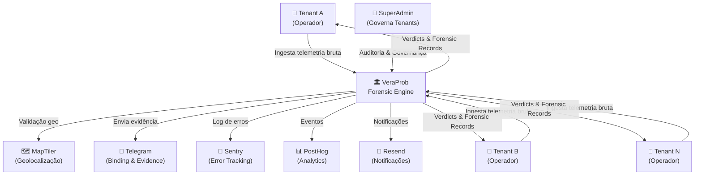
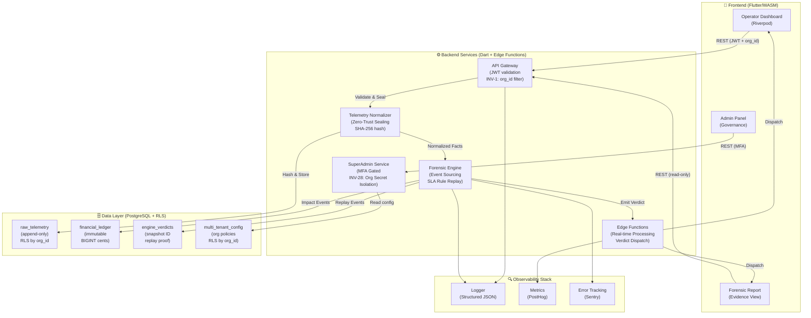
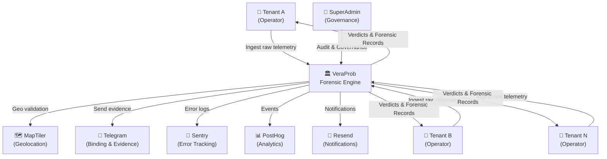

# VeraProb - Forensic Contract Governance

[](LICENSE)

[Português](#português) | [English](#english)

---

<a name="português"></a>
## Português

VeraProb é um estudo de engenharia focado em **Forensic Contract Governance**. O projeto implementa um motor de alta performance para validação determinística de SLAs de contratos B2B a partir de fluxos de telemetria bruta.

> [!WARNING]
> **Projeto Pessoal - Build to Learn**: Este repositório é um laboratório de experimentação técnica e arquitetura. O código não foi auditado, não possui ambiente de produção e **não deve ser utilizado em sistemas reais**.

### Objetivos Práticos
O repositório serve como sandbox individual para validar padrões arquiteturais de alta criticidade em sistemas distribuídos:
- **Solo-Enterprise Rigor**: Viabilidade de padrões Tier 1 (DDD, Event Sourcing, WASM) mantidos por um único desenvolvedor.
- **Forensic Accuracy**: Garantia de auditoria total de estado e transações via invariantes matemáticas (INV-4/5).
- **AI-Assisted Development**: Avaliação de limite de carga e manutenção de Clean Code através do desenvolvimento pareado com agentes de IA.

### Pilares de Engenharia
- **Domain-Driven Design (DDD)**: Domínio isolado e agnóstico de infraestrutura para execução das regras de contrato.
- **Event-Sourced Logic**: Replay determinístico de fatos sobre regras de SLA para geração de vereditos.
- **State Snapshots**: Consolidação de telemetria descentralizada em fatos canônicos.
- **Immutable Ledger**: Registro append-only imutável para selagem de impactos financeiros (INV-3).

### Arquitetura C4
#### C4 — Context (Visão de Sistema)


**Conceito**: VeraProb é um **Agnostic Forensic Engine** que ingesta telemetria bruta de múltiplos tenants isolados, aplica regras SLA determinísticas e emite vereditos imutáveis. SuperAdmin governa multi-tenancy sem acesso aos dados operacionais dos tenants (INV-22).

---

#### C4 — Container (Componentes Internos)

**Camadas de Isolamento (INV-13 — C4 Boundaries)**:
- **Presentation** (`lib/presentation/`): Recebe events, não toca em Domain
- **Application** (`lib/application/`): Orquestra serviços, aplica policies
- **Domain** (`lib/domain/`): Lógica pura (SLA Rules, Authority, Execution) — **AGNÓSTICO**
- **Infrastructure** (`lib/infrastructure/`): Postgres, Telegram, MapTiler (isolado por Ports/Adapters)

---

### Stack Tecnológica
- **Frontend**: Flutter (WASM), Riverpod, Design System focado em densidade de dados.
- **Backend**: Supabase, PostgreSQL (PostGIS), Edge Functions (Dart).
- **Segurança**: SHA-256, HMAC per-org (INV-28), Magic Bytes Entropy.
- **Ferramentas de Desenvolvimento**: Sequential Thinking (MCP), Custom AI Linters, Forensic Scanner.

### Execução Local

#### 1. Pré-requisitos
- **Flutter SDK** (3.41.9 Pinned)
- **Docker Desktop**
- **Supabase CLI**
- **Node.js** (>= 18)

#### 2. Setup
```bash
# Inicializar infraestrutura (Supabase)
supabase start
supabase db reset

# Preparar ambiente e dados (Makefile)
make setup
make env

# Construir ambiente de auditoria (Docker)
make build-test-env

# Executar aplicação
flutter run -d chrome --web-port=8080 --dart-define=SKIP_MFA_DEV=true
```

#### 3. Variáveis de Ambiente (Segurança)
Para cumprir a invariante de segurança **INV-2**, chaves e segredos nunca são mantidos no código-fonte:
- O comando `make env` gera o arquivo `.env` local (ignorado pelo Git).
- O arquivo `.env.example` contém os nomes das variáveis e chaves padrão para o stack local.
- **Credenciais de Teste**: O sistema utiliza credenciais determinísticas (`master@veraprob.dev`) exclusivamente para o bootstrap do ambiente local de desenvolvimento. Estas são credenciais públicas de teste e não possuem acesso a nenhum recurso real.
- **Testes de Integração**: O `PostgresTestConfig` carrega automaticamente as credenciais do `.env` durante a execução dos testes.

#### 4. Validação e Execução de Testes (`make full-check`)
O comando `make full-check` executa a verificação máxima do sistema (scans de segurança, testes unitários, de integração, E2E, caos e cobertura). Para que a suíte seja validada por completo sem ignorar (skip) testes dependentes de infraestrutura:
- **Supabase Local**: O stack de containers deve estar rodando (`supabase start`).
- **Edge Functions**: As funções devem estar servidas localmente em background (`supabase functions serve --env-file .env` ou via `make run`).
- **Provisionamento de Dados**: O Make executa automaticamente o `make setup` (`bootstrap_dev.mjs`) e injeta as credenciais do `.env` nos testes, garantindo que o usuário SuperAdmin (`master@veraprob.dev`) e os dados de telemetria estejam provisionados.

### Guia de Fluxo
| Ação | Comando | Descrição |
| :--- | :--- | :--- |
| **Ambiente** | `make build-test-env` | Constrói o container Linux de auditoria. |
| **Execução** | `flutter run` | Desenvolvimento local com Hot Reload. |
| **Check Forense** | `make check` | Valida integridade, segredos e padrões forenses. |
| **Full Check** | `make full-check` | Executa o check completo + testes unitários, E2E e de banco (requer Supabase local e Edge Functions ativas). |
| **Visual Regression** | `make goldens` | Gera/Valida capturas de tela em ambiente Linux. |

Para detalhes sobre as diretrizes de desenvolvimento e padrões de qualidade, consulte [CLAUDE.md](CLAUDE.md).

---

<a name="english"></a>
## English

VeraProb is an engineering study focused on **Forensic Contract Governance**. The project implements a high-performance engine designed for deterministic SLA validation of B2B contracts using raw telemetry streams.

> [!WARNING]
> **Personal Project - Build to Learn**: This repository is a technical playground for architecture and backend experimentation. The code is unaudited, lacks a live environment, and **must not be used in production systems**.

### Project Objectives
A solo sandbox designed to test high-criticality patterns in distributed systems:
- **Solo-Enterprise Rigor**: Assessing the maintainability of Tier 1 patterns (DDD, Event Sourcing, WASM) within a solo developer workflow.
- **Forensic Accuracy**: Ensuring full auditability of state and transactions via deterministic mathematical invariants (INV-4/5).
- **AI-Assisted Development**: Testing boundaries of code complexity and Clean Code standards when pairing with AI agents.

### Engineering Pillars
- **Domain-Driven Design (DDD)**: Infrastructure-agnostic domain layer executing core contract rules.
- **Event-Sourced Logic**: Deterministic replay of ingested facts against SLA rules to compute verdicts.
- **State Snapshots**: Unification of raw, decentralized telemetry into canonical facts.
- **Immutable Ledger**: Append-only, unalterable ledger for financial impact logging (INV-3).

### C4 Architecture
#### C4 — Context (System View)

**Concept**: VeraProb is an **Agnostic Forensic Engine** that ingests raw telemetry from multiple isolated tenants, applies deterministic SLA rules, and issues immutable verdicts. SuperAdmin governs multi-tenancy without access to tenant operational data (INV-22).

---

#### C4 — Container (Internal Components)

**Isolation Layers (INV-13 — C4 Boundaries)**:
- **Presentation** (`lib/presentation/`): Receives events, never touches Domain
- **Application** (`lib/application/`): Orchestrates services, enforces policies
- **Domain** (`lib/domain/`): Pure logic (SLA Rules, Authority, Execution) — **AGNOSTIC**
- **Infrastructure** (`lib/infrastructure/`): Postgres, Telegram, MapTiler (isolated via Ports/Adapters)

### Tech Stack
- **Frontend**: Flutter (WASM), Riverpod, High-density data UI layout.
- **Backend**: Supabase, PostgreSQL (PostGIS), Edge Functions (Dart).
- **Security**: SHA-256, HMAC per-org (INV-28), Magic Bytes Entropy.
- **Tooling**: Sequential Thinking (MCP), Custom AI Linters, Forensic Scanner.

### Local Execution
#### 1. Prerequisites
- **Flutter SDK** (3.41.9 Pinned)
- **Docker Desktop**
- **Supabase CLI**
- **Node.js** (>= 18)

#### 2. Setup
```bash
# Initialize infrastructure (Supabase)
supabase start
supabase db reset

# Prepare environment and data (Makefile)
make setup
make env

# Build audit environment (Docker)
make build-test-env

# Run application
flutter run -d chrome --web-port=8080 --dart-define=SKIP_MFA_DEV=true
```
#### 3. Environment Variables (Security)
To comply with the **INV-2** security invariant, keys and secrets are never kept in the source code:
- The `make env` command generates the local `.env` file (ignored by Git).
- The `.env.example` file contains the variable names and default keys for the local stack.
- **Test Credentials**: The system uses deterministic credentials (`master@veraprob.dev`) exclusively for local development environment bootstrap. These are public test credentials and have no access to any real resources.
- **Integration Tests**: `PostgresTestConfig` automatically loads credentials from `.env` during test execution.

#### 4. Test Validation and Execution (`make full-check`)
The `make full-check` command runs the ultimate validation suite (security scans, unit tests, integration, E2E, chaos, and coverage). To ensure the suite validates completely without skipping infrastructure-dependent tests:
- **Local Supabase**: The container stack must be active (`supabase start`).
- **Edge Functions**: Functions must be served locally in the background (`supabase functions serve --env-file .env` or via `make run`).
- **Data Provisioning**: Make automatically runs `make setup` (`bootstrap_dev.mjs`) and injects `.env` credentials into test runners, ensuring the SuperAdmin user (`master@veraprob.dev`) and telemetry seed data are properly provisioned.

### Workflow Guide
| Action | Command | Description |
| :--- | :--- | :--- |
| **Environment** | `make build-test-env` | Builds the Linux audit container. |
| **Run** | `flutter run` | Local development with Hot Reload. |
| **Forensic Check** | `make check` | Validates integrity, secrets, and forensic patterns. |
| **Full Check** | `make full-check` | Runs the full check + unit, E2E, and database tests (requires local Supabase and running Edge Functions). |
| **Visual Regression** | `make goldens` | Generates/Validates screenshots in Linux environment. |

For development guidelines and quality standards, refer to [CLAUDE.md](CLAUDE.md).