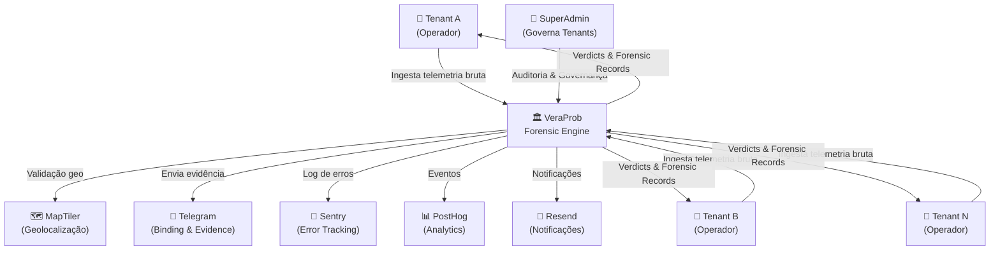
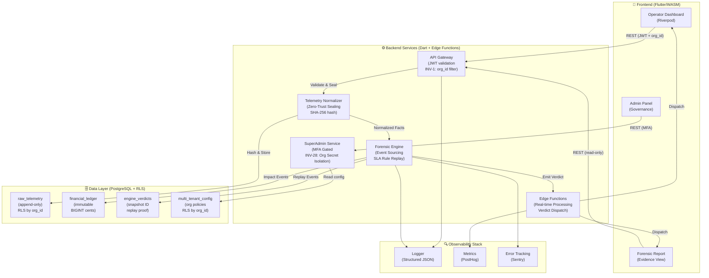
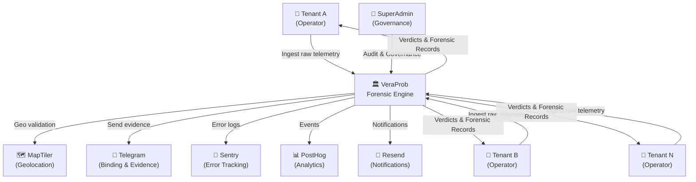

# VeraProb - Forensic Contract Governance

[](LICENSE)

[Português](#português) | [English](#english)

---

<a name="português"></a>
## Português

VeraProb é uma **Plataforma Tier-1 de Auditoria Forense, Conciliação Financeira e Gestão de SLAs** projetada para operações logísticas de grande escala. Atuando como um "juiz digital e imutável" entre Embarcadores (Tenants) e Transportadoras (Carriers), o sistema transforma o caos da telemetria IoT e multas de frete em um fluxo financeiro auditável, resolvendo o vazamento de receita e passivos trabalhistas/contratuais de frotas e veículos de viagem.

> [!WARNING]
> **Laboratório de Engenharia Especializada**: Este repositório é um ambiente de experimentação técnica. Embora implemente rigor de nível enterprise e segurança determinística (pronta para conformidade SOC 2), o ecossistema atual opera de forma independente e não passou por processos de auditoria externa formal.

### Os 4 Pilares de Negócio
1. **Ingestão e Integridade de Telemetria (IoT)**: Avalia o *Confidence Score* do sinal GPS e monitora a saúde do hardware (Ingestion Health Monitor), garantindo que áreas de sombra não gerem falsas punições.
2. **Motor de Contratos e SLA Audit**: Cruza telemetria da frota com regras de contrato. Identifica violações (atrasos, desvios, anomalias) e calcula o risco financeiro em centavos de forma 100% automatizada.
3. **Máquina de Disputas e Resolução Forense**: Um Portal Zero-Trust para transportadoras anexarem contraprovas. Toda resolução gera um pacote de evidências selado criptograficamente (SHA-256) garantindo Cadeia de Custódia e valor legal (SOX/SOC2).
4. **Shadow Ledger Financeiro**: Contabilidade de Risco em tempo real. Exibe Volatilidade Financeira, Receita em Risco e ROI. Aplica *Financial Guard/Stop-Loss* (teto de cobrança) para proteger parceiros de falência por erros sistêmicos.

### Pilares de Engenharia
- **Domain-Driven Design (DDD)**: Domínio isolado e agnóstico de infraestrutura para execução das regras de contrato.
- **Event-Sourced Logic**: Replay determinístico de fatos sobre regras de SLA para geração de vereditos.
- **State Snapshots**: Consolidação de telemetria descentralizada em fatos canônicos.
- **Immutable Ledger**: Registro append-only imutável para selagem de impactos financeiros (INV-3).

### Arquitetura C4
#### C4 — Context (Visão de Sistema)


**Conceito**: VeraProb é um **Agnostic Forensic Engine** que ingesta telemetria bruta de múltiplos tenants isolados, aplica regras SLA determinísticas e emite vereditos imutáveis. SuperAdmin governa multi-tenancy sem acesso aos dados operacionais dos tenants (INV-22).

---

#### C4 — Container (Componentes Internos)

**Camadas de Isolamento (INV-13 — C4 Boundaries)**:
- **Presentation** (`lib/presentation/`): Recebe events, não toca em Domain
- **Application** (`lib/application/`): Orquestra serviços, aplica policies
- **Domain** (`lib/domain/`): Lógica pura (SLA Rules, Authority, Execution) — **AGNÓSTICO**
- **Infrastructure** (`lib/infrastructure/`): Postgres, Telegram, MapTiler (isolado por Ports/Adapters)

---
### Decisões Arquiteturais ("Why This Architecture?")

A complexidade arquitetural do VeraPrab justifica-se pela necessidade de **rigor forense, não-repúdio e integridade sob falhas**, operando como um motor de governança financeira.

- **Clean Architecture + DDD (C4 Boundaries)**
  - *Decisão*: Isolamento do core de validação (`lib/domain/`) contra dependências de infraestrutura (Supabase, Postgres, MapTiler).
  - *Motivação*: Garantir que regras de negócio e SLAs contratuais sejam independentes de mudanças em serviços externos e banco de dados.
  - *Trade-off*: Aumento de boilerplate inicial devido à introdução de DTOs e mapeadores de limites. Decisão assumida para viabilizar testabilidade em isolamento e mitigar vazamento de infraestrutura (**INV-13**).

- **Event-Sourcing Core**
  - *Decisão*: Persistência de telemetria bruta como fatos imutáveis e cálculo de vereditos via replay sob demanda, abdicando do armazenamento de estados mutáveis pré-compilados.
  - *Motivação*: Vereditos de quebra de SLA exigem auditabilidade matemática. A reconstrução determinística da linha do tempo mitiga contestações e habilita depuração de estados históricos (*Time-Travel Debugging*).
  - *Trade-off*: Maior custo computacional em leituras e reconstituição de agregados. Impacto mitigado pela implementação de *Snapshots* periódicos de estado e índices otimizados.

- **Ledger Append-Only**
  - *Decisão*: Bloqueio de comandos `UPDATE` ou `DELETE` a nível de banco de dados para registros financeiros e vereditos.
  - *Motivação*: Garantia de rastreabilidade forense. Correções ou contestações de valores exigem lançamentos compensatórios (estornos ou novas transações), preservando o histórico original imutável.

- **Ingestão Zero-Trust**
  - *Decisão*: Validação de assinatura criptográfica (HMAC per-org — **INV-28**) e geração de hash SHA-256 de toda telemetria na camada de borda (Edge Functions), antes do processamento do motor.
  - *Motivação*: Dispositivos periféricos e web clients estão expostos a interceptações e spoofing. O não-repúdio é estabelecido imediatamente no ponto de entrada do sistema.

---

### Matriz de Invariantes Forenses

O sistema implementa 28 invariantes determinísticos para proteção de estado, mapeados em 4 pilares:

#### 1. Isolamento de Tenant e Identidade
- **INV-1 & INV-2 (Escopo Mandatório & RLS Hardening)**: Toda query aplica filtro por `organization_id`. As políticas de Row Level Security (RLS) utilizam estritamente a claim do JWT (`auth.jwt() ->> 'organization_id'`), isolando o contexto transacional.
- **INV-22 (Isolamento de Tenants)**: Garantia de segregação de dados entre organizações distintas, validada via testes automatizados de intrusão.
- **INV-26 & INV-27 (Defesa Contra Ataques Oráculo)**: Endpoints sensíveis retornam `404 Not Found` para recursos inexistentes ou pertencentes a outros tenants, mitigando a enumeração de recursos por inferência de código HTTP.

#### 2. Integridade do Ledger e Precisão Matemática
- **INV-3 (Registro Append-Only)**: Bloqueio nativo de mutabilidade ou exclusão física em tabelas financeiras e de vereditos.
- **INV-4 & INV-5 (Precisão Monetária e BPS)**: Valores financeiros utilizam tipo `BIGINT` (centavos) em persistência, `int` em transporte e Value Object `Money` no domínio para evitar erros de ponto flutuante. Operações com Basis Points (BPS) aplicam lógica simétrica de arredondamento.
- **INV-21 (Rastro por Snapshot ID)**: Vereditos emitidos carregam o identificador criptográfico único do estado gerador, permitindo reprodução determinística byte a byte.

#### 3. Sincronismo Temporal e Espacial
- **INV-6 & INV-20 (UTC Mandatório & Normalização de Janelas)**: Manipulação temporal restrita ao tipo `TIMESTAMPTZ` e injetada via provedor selado (`IDateTimeProvider.nowUtc()`). Variações de relógio local de dispositivos externos (clock drifts) são calculadas e seladas na ingestão.

#### 4. Segurança de Execução e Tipagem
- **INV-7 & INV-10 (Tipagem Estrita e Exceções de Domínio)**: Proibição do tipo `dynamic`. Violações de integridade disparam exceções tipadas de aplicação (`IntegrityException`), impedindo a exposição de stack traces genéricos de infraestrutura.
- **INV-24 & INV-28 (Isolamento HMAC)**: Validação de telemetria baseada em chave secreta HMAC única por organização, armazenada de forma isolada e rotacionada de forma programática.

---

### Modelo de Ameaças & Controles de Segurança

Mapeamento de vetores de ataque contra o motor forense e respectivos mecanismos estruturais de mitigação:

| Vetor de Ameaça | Impacto do Ataque | Controles Arquiteturais (Mitigação) |
| :--- | :--- | :--- |
| **Vazamento Cruzado (Cross-Tenant Leak)** | Acesso ou adulteração de dados entre tenants distintos. | RLS ativo baseado em claim de organização no JWT (**INV-2**), escopo mandatório de `organization_id` em queries (**INV-1**) e testes automatizados de intrusão (**INV-22**). |
| **Ataque de Enumeração (Oracle Attack)** | Mapeamento de registros de terceiros por variação de resposta HTTP (ex: 403 vs 404). | Paridade de erro estrita (**INV-26** & **INV-27**): acessos não autorizados ou IDs inválidos retornam código unificado `404 Not Found` para mitigar inferências. |
| **Adulteração de Histórico** | Modificação retroativa de telemetria ou vereditos para burlar penalidades de SLA. | Restrição append-only em banco de dados (**INV-3**), selagem por hash SHA-256 na ingestão e vinculação de vereditos a Snapshot IDs imutáveis (**INV-21**). |
| **Spoofing / Replay de Telemetria** | Injeção de dados falsos em nome de um dispositivo ou reenvio de pacotes capturados. | Validação de assinatura digital via HMAC individualizado por Tenant (**INV-28**) e tratamento de idempotência na camada de borda. |
| **Manipulação Temporal (Clock Spoofing)** | Envio de telemetria com data retroativa ou futura para fraudar janelas contratuais. | Cálculo de variação (drift) e rejeição de relógio local de dispositivos não validados (**INV-6**), armazenamento em `TIMESTAMPTZ` e relógio canônico em UTC. |

---

### Stack Tecnológica
- **Frontend**: Flutter (WASM), Riverpod, Design System focado em densidade de dados.
- **Backend**: Supabase, PostgreSQL (PostGIS), Edge Functions (Dart).
- **Segurança**: SHA-256, HMAC per-org (INV-28), Magic Bytes Entropy.
- **Ferramentas de Desenvolvimento**: Sequential Thinking (MCP), Custom AI Linters, Forensic Scanner.

### Execução Local

#### 1. Pré-requisitos
- **Flutter SDK** (3.41.9 Pinned)
- **Docker Desktop**
- **Supabase CLI**
- **Node.js** (>= 18)

#### 2. Setup
```bash
# Inicializar infraestrutura (Supabase)
supabase start
supabase db reset

# Preparar ambiente e dados (Makefile)
make setup
make env

# Construir ambiente de auditoria (Docker)
make build-test-env

# Executar aplicação
flutter run -d chrome --web-port=8080 --dart-define=SKIP_MFA_DEV=true
```

#### 3. Variáveis de Ambiente (Segurança)
Para cumprir a invariante de segurança **INV-2**, chaves e segredos nunca são mantidos no código-fonte:
- O comando `make env` gera o arquivo `.env` local (ignorado pelo Git).
- O arquivo `.env.example` contém os nomes das variáveis e chaves padrão para o stack local.
- **Credenciais de Teste**: O sistema utiliza credenciais determinísticas (`master@veraprob.dev`) exclusivamente para o bootstrap do ambiente local de desenvolvimento. Estas são credenciais públicas de teste e não possuem acesso a nenhum recurso real.
- **Testes de Integração**: O `PostgresTestConfig` carrega automaticamente as credenciais do `.env` durante a execução dos testes.

#### 4. Validação e Execução de Testes (`make full-check`)
O comando `make full-check` executa a verificação máxima do sistema (scans de segurança, testes unitários, de integração, E2E, caos e cobertura). Para que a suíte seja validada por completo sem ignorar (skip) testes dependentes de infraestrutura:
- **Supabase Local**: O stack de containers deve estar rodando (`supabase start`).
- **Edge Functions**: As funções devem estar servidas localmente em background (`supabase functions serve --env-file .env` ou via `make run`).
- **Provisionamento de Dados**: O Make executa automaticamente o `make setup` (`bootstrap_dev.mjs`) e injeta as credenciais do `.env` nos testes, garantindo que o usuário SuperAdmin (`master@veraprob.dev`) e os dados de telemetria estejam provisionados.

### Guia de Fluxo
| Ação | Comando | Descrição |
| :--- | :--- | :--- |
| **Ambiente** | `make build-test-env` | Constrói o container Linux de auditoria. |
| **Execução** | `flutter run` | Desenvolvimento local com Hot Reload. |
| **Check Forense** | `make check` | Valida integridade, segredos e padrões forenses. |
| **Full Check** | `make full-check` | Executa o check completo + testes unitários, E2E e de banco (requer Supabase local e Edge Functions ativas). |
| **Visual Regression** | `make goldens` | Gera/Valida capturas de tela em ambiente Linux. |

Para detalhes sobre as diretrizes de desenvolvimento e padrões de qualidade, consulte [CLAUDE.md](CLAUDE.md).

---

<a name="english"></a>
## English

VeraProb is a **Tier-1 Forensic Audit, Financial Conciliation, and SLA Management Platform** built for large-scale logistics and fleet operations. Acting as a "digital, immutable judge" between Shippers (Tenants) and Carriers, the system transforms the chaos of IoT telemetry and freight penalties into an auditable financial stream, resolving revenue leakage and contractual/labor liabilities.

> [!WARNING]
> **Specialized Engineering Lab**: This repository is a technical playground. Although it implements enterprise-grade rigor and deterministic security (SOC 2-ready), the current ecosystem operates independently and has not undergone formal external auditing processes.

### The 4 Business Pillars
1. **Telemetry Integrity & IoT Ingestion**: Calculates signal *Confidence Scores* and monitors hardware health (Ingestion Health Monitor) to ensure GPS blind spots aren't punished as SLA breaches.
2. **Contract Engine & SLA Audit**: Cross-references raw fleet telemetry with contract rules. Autonomously identifies violations (delays, kinematic anomalies, route deviations) and calculates exact financial penalties.
3. **Forensic Dispute Resolution Machine**: A Zero-Trust Portal for carriers to submit counter-evidence. Every resolution creates a SHA-256 cryptographically sealed evidence package, guaranteeing a pristine Chain of Custody (SOX/SOC2 compliance).
4. **Shadow Financial Ledger**: Real-time Risk Accounting. Projects Financial Volatility, Revenue at Risk, and Protected ROI. Enforces a *Financial Guard (Stop-Loss)* to protect partners from bankruptcy due to systemic cascading penalties.

### Engineering Pillars
- **Domain-Driven Design (DDD)**: Infrastructure-agnostic domain layer executing core contract rules.
- **Event-Sourced Logic**: Deterministic replay of ingested facts against SLA rules to compute verdicts.
- **State Snapshots**: Unification of raw, decentralized telemetry into canonical facts.
- **Immutable Ledger**: Append-only, unalterable ledger for financial impact logging (INV-3).

### C4 Architecture
#### C4 — Context (System View)

**Concept**: VeraProb is an **Agnostic Forensic Engine** that ingests raw telemetry from multiple isolated tenants, applies deterministic SLA rules, and issues immutable verdicts. SuperAdmin governs multi-tenancy without access to tenant operational data (INV-22).

---

#### C4 — Container (Internal Components)

**Isolation Layers (INV-13 — C4 Boundaries)**:
- **Presentation** (`lib/presentation/`): Receives events, never touches Domain
- **Application** (`lib/application/`): Orchestrates services, enforces policies
- **Domain** (`lib/domain/`): Pure logic (SLA Rules, Authority, Execution) — **AGNOSTIC**
- **Infrastructure** (`lib/infrastructure/`): Postgres, Telegram, MapTiler (isolated via Ports/Adapters)

---
### Architectural Decisions ("Why This Architecture?")

VeraProb's architectural complexity is driven by the requirements of **forensic rigor, non-repudiation, and runtime integrity under failure**, serving as a robust financial governance engine.

- **Clean Architecture + DDD (C4 Boundaries)**
  - *Decision*: Strict isolation of the validation core (`lib/domain/`) from volatile infrastructure dependencies (Supabase, Postgres, MapTiler).
  - *Motivation*: To ensure contractual SLAs and core business rules remain unaffected by database migrations, framework upgrades, or third-party API changes. 
  - *Trade-off*: Increases initial boilerplate due to the introduction of DTOs and boundary mappers. This is an explicit trade-off to enable pure, isolated testability and prevent infrastructure leaks (**INV-13**).

- **Event-Sourcing Core**
  - *Decision*: Raw telemetry is persisted as immutable facts, computing verdicts via on-demand replay instead of storing pre-compiled mutable states.
  - *Motivation*: SLA breach verdicts require mathematical auditability. Reconstructing the exact event timeline mitigates commercial or legal disputes and enables historical debugging (*Time-Travel Debugging*).
  - *Trade-off*: Higher computational overhead during reads and aggregate reconstitution. This is mitigated through periodic state *Snapshots* and highly optimized query paths.

- **Append-Only Ledger**
  - *Decision*: Database-level lockdown prohibiting `UPDATE` or `DELETE` execution on financial records and engine verdicts.
  - *Motivation*: To guarantee structural forensic traceability. Historical corrections or state adjustments require compensatory ledger entries (reversals), leaving the original timeline untouched.

- **Zero-Trust Ingestion**
  - *Decision*: Telemetry payloads are treated as hostile until normalized, validated against tenant-specific HMAC signatures (**INV-28**), and cryptographically sealed using SHA-256 at the edge (Edge Functions).
  - *Motivation*: Peripheral devices and web clients are vulnerable to intercept attacks and spoofing. Non-repudiation is established immediately at the system's entry point.

---

### Threat Model & Security Controls

Attack vectors mapping against the forensic engine and corresponding architectural mitigations:

| Threat Vector | Attack Impact | Architectural Controls (Mitigation) |
| :--- | :--- | :--- |
| **Cross-Tenant Data Leak** | Cross-tenant data access, leakage, or tampering. | RLS enforced via organization JWT claims (**INV-2**), mandatory query filtering (**INV-1**), and automated penetration testing (**INV-22**). |
| **Oracle / Enumeration Attack** | Mapping third-party records via HTTP status code variations (e.g., 403 vs 404). | Strict error parity (**INV-26** & **INV-27**): unauthorized queries or ownership mismatches return a unified `404 Not Found` to prevent data inference. |
| **Evidence / History Tampering** | Retroactive modification of telemetry or verdicts to bypass SLA financial penalties. | Append-only database constraints (**INV-3**), immediate SHA-256 evidence hashing at ingest, and binding to immutable state Snapshot IDs (**INV-21**). |
| **Telemetry Spoofing / Replay** | Injection of spoofed data mimicking a valid device, or replay of valid historical telemetry. | Mandatory tenant-specific HMAC signature verification (**INV-28**) and ingestion-layer idempotency constraints. |
| **Temporal Manipulation** | Submitting backdated or future-dated telemetry to forge SLA contract windows. | Detection and rejection of unvalidated client device clock drifts (**INV-6**), strict `TIMESTAMPTZ` storage, and canonical UTC time providers. |

---

### Forensic Invariants Matrix

The system implements 28 deterministic invariants to enforce state protection, mapped into 4 critical pillars:

#### 1. Tenant Isolation & Identity Protection
- **INV-1 & INV-2 (Mandatory Filtration & RLS Hardening)**: Every query enforces filtration by `organization_id`. Row Level Security (RLS) policies exclusively resolve identity using JWT claims (`auth.jwt() ->> 'organization_id'`), completely isolating the transactional context.
- **INV-22 (Tenant Isolation)**: Guarantees that Tenant A cannot access or infer data belonging to Tenant B, validated via automated penetration testing scripts.
- **INV-26 & INV-27 (Anti-Oracle Defenses)**: Sensitive API endpoints return a unified `404 Not Found` for non-existent or cross-tenant resources, mitigating database mapping through HTTP status code inference.

#### 2. Ledger Integrity & Mathematical Rigor
- **INV-3 (Append-Only Enforcement)**: Native database-level blocking of mutation or physical deletion on ledger and verdict tables.
- **INV-4 & INV-5 (Monetary Type & Basis Point Precision)**: Monetary values utilize `BIGINT` (cents) for persistence, `int` for transit, and wrap into a `Money` Value Object in the domain to eliminate floating-point errors. Basis Point (BPS) operations apply strict symmetric rounding.
- **INV-21 (Traceable Snapshot IDs)**: Generated verdicts carry a unique, immutable cryptographic identifier of the generating database state, allowing byte-identical replay.

#### 3. Temporal and Spatial Determinism
- **INV-6 & INV-20 (UTC Mandatory & Windows Normalization)**: Date handling is restricted to `TIMESTAMPTZ` and driven by a hermetic provider (`IDateTimeProvider.nowUtc()`). Ingested device clock drifts are calculated and sealed at the ingestion layer to prevent temporal spoofing.

#### 4. Execution Security & Strict Typing
- **INV-7 & INV-10 (Strict Typing & Domain Exceptions)**: Prohibits the use of the `dynamic` type in application layers. Integrity breaches trigger explicit, typed application errors (`IntegrityException`), preventing the exposure of raw infrastructure stack traces.
- **INV-24 & INV-28 (HMAC Isolation)**: Ingested telemetry validation is tied to a unique HMAC secret key per organization, securely stored and programmatically rotated.

---
### Tech Stack
- **Frontend**: Flutter (WASM), Riverpod, High-density data UI layout.
- **Backend**: Supabase, PostgreSQL (PostGIS), Edge Functions (Dart).
- **Security**: SHA-256, HMAC per-org (INV-28), Magic Bytes Entropy.
- **Tooling**: Sequential Thinking (MCP), Custom AI Linters, Forensic Scanner.

### Local Execution
#### 1. Prerequisites
- **Flutter SDK** (3.41.9 Pinned)
- **Docker Desktop**
- **Supabase CLI**
- **Node.js** (>= 18)

#### 2. Setup
```bash
# Initialize infrastructure (Supabase)
supabase start
supabase db reset

# Prepare environment and data (Makefile)
make setup
make env

# Build audit environment (Docker)
make build-test-env

# Run application
flutter run -d chrome --web-port=8080 --dart-define=SKIP_MFA_DEV=true
```
#### 3. Environment Variables (Security)
To comply with the **INV-2** security invariant, keys and secrets are never kept in the source code:
- The `make env` command generates the local `.env` file (ignored by Git).
- The `.env.example` file contains the variable names and default keys for the local stack.
- **Test Credentials**: The system uses deterministic credentials (`master@veraprob.dev`) exclusively for local development environment bootstrap. These are public test credentials and have no access to any real resources.
- **Integration Tests**: `PostgresTestConfig` automatically loads credentials from `.env` during test execution.

#### 4. Test Validation and Execution (`make full-check`)
The `make full-check` command runs the ultimate validation suite (security scans, unit tests, integration, E2E, chaos, and coverage). To ensure the suite validates completely without skipping infrastructure-dependent tests:
- **Local Supabase**: The container stack must be active (`supabase start`).
- **Edge Functions**: Functions must be served locally in the background (`supabase functions serve --env-file .env` or via `make run`).
- **Data Provisioning**: Make automatically runs `make setup` (`bootstrap_dev.mjs`) and injects `.env` credentials into test runners, ensuring the SuperAdmin user (`master@veraprob.dev`) and telemetry seed data are properly provisioned.

### Workflow Guide
| Action | Command | Description |
| :--- | :--- | :--- |
| **Environment** | `make build-test-env` | Builds the Linux audit container. |
| **Run** | `flutter run` | Local development with Hot Reload. |
| **Forensic Check** | `make check` | Validates integrity, secrets, and forensic patterns. |
| **Full Check** | `make full-check` | Runs the full check + unit, E2E, and database tests (requires local Supabase and running Edge Functions). |
| **Visual Regression** | `make goldens` | Generates/Validates screenshots in Linux environment. |

For development guidelines and quality standards, refer to [CLAUDE.md](CLAUDE.md).
