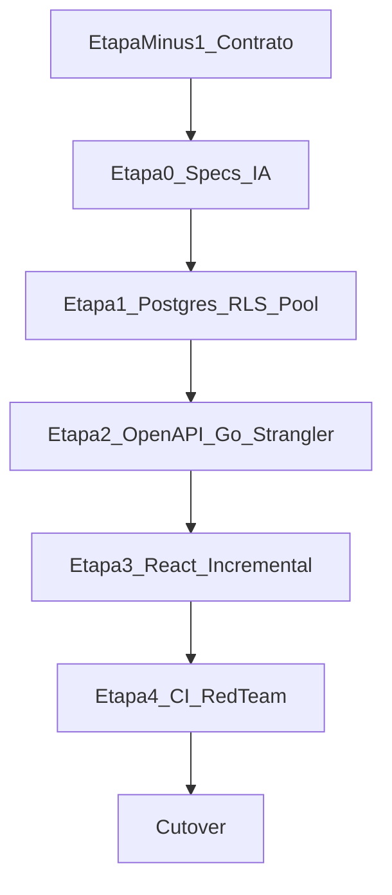

# Phase 11 — Enterprise Pivot (Proposta Canônica, Etapa −1)

**Date:** 2026-07-21  
**Status:** Proposed contract (veredicto Etapa −1 ao final deste documento)  
**Commit baseline:** `4d4786516c5d2800aad8873e3633faa750f067bb`  
**collected_at:** `2026-07-21T19:34:21Z`  
**Author (draft):** Migration Owner (execução documental Etapa −1)  
**Roadmap file:** `docs/governance/roadmap.md` — **NÃO ALTERADO** nesta etapa

## 1. Objetivo

Produzir o **contrato documental** que permite ao Council decidir formalmente **PASS** ou **REVISE** da Etapa −1 do Enterprise Pivot. Esta proposta é a SSOT durável para reviews, veredicto e status do roadmap. Não executa Etapas 0–4, cutover, nem implementação.

## 2. Contexto e baseline

- Stack atual: Supabase (Postgres + Auth + Edge + Storage) + Flutter Wasm.
- JWT P0 criptográfico validado (baseline **temporário**); residual: AAL2 em `reveal-webhook-signing-secret` e revogação pré-`exp` com `getClaims` — ver `forensic_records/plans/20260721000000_jwt_p0_residual_risks.md`.
- Edge Functions reais inventariadas: **22** (prova em inventário).
- Migrations reais: **377** `.sql` (divergência vs texto histórico “365”).
- Direção `Go + OpenAPI 3.0 + PostgreSQL 16 + React` é **alternativa candidata** (ADR-010), **não** decisão Accepted.

## 3. Sequência preservada



Etapa 0 só após **PASS** formal da Etapa −1.

## 4. Restrições congeladas (não são o destino de stack)

| Restrição | Valor |
|-----------|-------|
| Estratégia | Strangler Fig + dual-run; **big-bang proibido** |
| Schema no pivot | Lift-and-shift; sem redesign oportunista |
| ALE/KMS layout | Somente pós-cutover |
| Flutter + Supabase | Permanecem até gates por fatia |
| React | Só consome APIs Go com paridade aprovada |
| ADRs | Nascem `Proposed`; sem autoaceitação |
| Roadmap | Sem edição automática em qualquer marco |
| JWT P0 | Não é autenticação definitiva do Go |

## 5. Alternativas ainda em decisão

Ver [ADR-010](../adr/010_exit_supabase.md): permanecer Supabase; híbrido; self-host candidato. Go/no-go econômico bloqueado por `pending_quote` (TCO/FTE/RPO/RTO).

## 6. Artefatos SSOT (oito)

| # | Artefato |
|---|----------|
| 1 | Este arquivo — proposta + Council + veredicto |
| 2 | [ADR-010 Exit Supabase](../adr/010_exit_supabase.md) |
| 3 | [ADR-011 Auth Zero-Trust](../adr/011_auth_zero_trust.md) |
| 4 | [ADR-012 RLS / connection lifecycle](../adr/012_rls_connection_lifecycle.md) |
| 5 | [ADR-013 Strangler Fig](../adr/013_strangler_fig.md) |
| 6 | [Inventário Edge Functions](phase11_edge_functions_inventory.md) |
| 7 | [Threat model](phase11_threat_model.md) |
| 8 | [Parity checklist](phase11_parity_checklist.md) |

## 7. Proibições explícitas nesta etapa

- Implementação Go/React/Postgres self-host, OpenAPI, dual-run runtime, cutover
- Alterar `AGENTS.md`, invariantes, agents, skills, scanners, CI-blocks
- Remover ou enfraquecer regras Flutter/Supabase
- Redesign de schema / ALE
- Alterar `docs/governance/roadmap.md`
- Reutilizar aprovação do Council JWT/verifier anterior como aceite desta Etapa −1
- Commit

## 8. Matriz de rastreabilidade

| Requirement ID | Requisito/fonte | Etapa plano | Artefato SSOT | Critério de aceitação | Evidência verificável | Owner | Reviewer | Gate bloqueante | Risco se omitido |
|----------------|-----------------|-------------|---------------|----------------------|----------------------|-------|----------|-----------------|------------------|
| R-01 | Proposta canônica e limites | 6 | Esta proposta | Links válidos aos 7 artefatos; sequência explícita | Paths existem no git status allowlist | Migration Owner | Lead Reviewer | Y | Implementação prematura |
| R-02 | Decisão econômica/técnica saída | 7 | ADR-010 | Alternativas + TCO 12/24 + fontes + go/no-go | Tabelas TCO; pendências com prazo | Business+Platform Owner | Architect | Y | Migração sem ROI |
| R-02.1 | Quotes TCO/FTE/RPO/RTO | 7 | ADR-010 | Nenhuma linha go/no-go custo sem fonte | Status `pending_quote` explícito | Platform Owner | Architect | Y (bloqueia Accepted) | Accepted indevido |
| R-03 | Auth/sessões Zero-Trust | 8 | ADR-011 | Lifecycle completo + testes | Seções ADR-011; PG-AUTH/SESSION/REVOCATION/AAL2 | Identity Owner | QA/Security | Y | Bypass/contas irrecuperáveis |
| R-03.1 | Residual AAL2 reveal | 8 | ADR-011 + threat T-26 | Owner+controle+teste+gate | PG-AAL2 | Identity Owner | QA/Security | Y | Reveal aal1 |
| R-03.2 | Residual revogação pré-exp | 8 | ADR-011 + threat T-27 | Owner+controle+teste+gate | PG-REVOCATION | Identity Owner | QA/Security | Y | Sessão zumbi |
| R-04 | Tenant/RLS/conexões | 9 | ADR-012 | Estados/roles/bleed tests | State machine + PG-POOL-BLEED | Data Platform Owner | QA/Security | Y | Tenant bleed |
| R-05 | Strangler/dual-run/cutover | 10 | ADR-013 | Fatias, shadow, rollback &lt;15m | ADR-013 + PG-ROLLBACK/DUAL-RUN | Migration Owner | Architect | Y | Big-bang |
| R-06 | Inventário 1:1 real | 5 | Inventário | A−B=∅; B−A=∅; unicidade | §2 inventário; 22 nomes | Edge Runtime Owner | Senior Engineer | Y | Função omitida |
| R-07 | Threat model | 11 | Threat model | Campos completos por ameaça | Tabela T-01..T-28 | Security Owner | QA/Security | Y | Ameaça sem controle |
| R-08 | Parity gates | 12 | Checklist | Schema completo; catálogo mínimo | Todas as linhas PG-* | QA Owner | Lead Reviewer | Y | Paridade subjetiva |
| R-09 | Validação documental | 13 | Esta proposta §10 | docs-check + LF + links + hash roadmap | §10 outputs | Documentation Owner | Lead Reviewer | Y | Drift |
| R-10 | Reviews independentes | 14 | Esta proposta §11 | Architect, Senior, QA/Security, Lead separados | Pareceres datados + hash | Council | Lead Reviewer | Y | Autoaprovação |
| R-11 | Veredicto estrito | 15 | Esta proposta §12 | PASS ou REVISE por algoritmo | §12 | Lead Reviewer | — | Y | PASS indevido |
| R-12 | Dois marcos roadmap | 16 | Esta proposta §13 | Status sem editar roadmap.md | §13 texto | Program Owner | Lead Reviewer | Y | Roadmap prematuro |

### Accountability / escalonamento

| Role | Identidade accountable (papel) | Escalation |
|------|-------------------------------|------------|
| Migration Owner | Programa Phase 11 | Architect → Lead |
| Business+Platform Owner | FinOps + Platform | Lead |
| Identity Owner | Auth/security engineering | Security Owner → Lead |
| Data Platform Owner | DB/RLS | QA/Security → Lead |
| Edge Runtime Owner | Edge Functions | Senior → Lead |
| Security Owner | Threat model | QA/Security → Lead |
| QA Owner | Parity gates | Lead |
| Program Owner | Roadmap marcos | Lead |
| Documentation Owner | Validação documental | Lead |

## 9. Pendências bloqueantes conhecidas (draft)

| ID | Descrição | Owner | Prazo ISO | Gate | Bloqueia |
|----|-----------|-------|-----------|------|----------|
| P-TCO-01 | Quotes TCO 12/24 + FTE ops | Platform Owner (coleta) + Finance/CFO (validação) | 2026-08-30 | ADR-010 Accepted / R-02 | Y — Accepted ADR-010 e PASS −1 |
| P-DR-01 | RPO/RTO objetivos self-host | Platform Owner | 2026-08-30 | PG-DR / ADR-010 | Y |
| P-PERF-01 | Baseline p95 dual-run | Platform Owner | 2026-08-15 | PG-PERFORMANCE | Y para cutover; contrato −1 registra |
| P-AAL2-01 | Remediação AAL2 reveal (Edge) **ou** freeze/disable da rota até aal1→deny | Identity Owner | 2026-08-07 | PG-AAL2 | **Y — bloqueia PASS Etapa −1 e entrada Etapa 0** (não congelar buraco no dual-run) |
| P-REV-01 | Desenho revogação pré-exp (session store) | Identity Owner | 2026-08-21 | PG-REVOCATION | Y para Accepted auth alvo; track obrigatório no contrato −1 |

## 10. Validação documental

| Check | Comando/método | Resultado | Timestamp UTC |
|-------|----------------|-----------|---------------|
| Artefatos presentes | `Test-Path` × 8 | OK (8/8) | 2026-07-21T19:41:45Z |
| `make docs-check` | `make docs-check` | OK — CI Blocks 22 + Lessons 15 sync | 2026-07-21T19:41:45Z |
| LF / `git diff --check` | CRLF count + `git diff --check` | CRLF=0 em todos; diff --check limpo | 2026-07-21T19:41:45Z |
| Links locais | paths relativos siblings | Destinos dos 8 artefatos existem | 2026-07-21T19:41:45Z |
| Inventário A=B | recontagem `index.ts` dirs | count=22; A−B=∅ | 2026-07-21T19:41:45Z |
| Roadmap hash estável | `git hash-object docs/governance/roadmap.md` | `7991220efb28a6520e76756400a21add42e1c007` (inalterado vs preflight) | 2026-07-21T19:41:45Z |
| Fora allowlist | `git status --short` | Somente `??` nos 8 artefatos / `proposals/` + 4 ADRs | 2026-07-21T19:41:45Z |
| Status ADR | grep `**Status:**` | 010–013 = Proposed (nenhum Accepted) | 2026-07-21T19:41:45Z |
| TBD bloqueante | matriz §9 | P-TCO-01, P-DR-01 (e correlatos) presentes → **impede PASS** | 2026-07-21T19:41:45Z |

## 11. Registro do Council

> Pareceres independentes (agentes persona), datados e vinculados à revisão documental H1 (pós-correções XR/P-TCO/T-28..T-30/P-AAL2). Autor do draft **não** aprova os próprios ADRs. ADRs **permanecem Proposed** — sem autoridade CFO/humana promovendo Accepted nesta execução.

| Persona | Agente/ID | Hash revisão | Data UTC | Veredicto | Findings |
|---------|-----------|--------------|----------|-----------|----------|
| Architect | [Architect](3668ebf0-8a71-46a6-9ab7-d21280370aea) | H1 (pré+pós XR fix) | 2026-07-21 | **REVISE** | BLOCKER: namespace Etapa vs exit-ramp (corrigido → XR-*); HIGH: destiny framing, P-TCO drift, preferência self-host sem quotes |
| Senior Engineer | [Senior](4ad0061c-a3a9-4ac7-9ce7-c4b4de1ef7fc) | H1 | 2026-07-21 | **REVISE** | Mesmo conflito de etapas/P-TCO; inventário 22 + ADR-012 aprováveis em qualidade |
| QA/Security | [QA/Security](1a604ee8-70ad-4faf-a869-1feb792bb69a) | H1 | 2026-07-21 | **REVISE** | BLOCKER: P-AAL2-01 deve bloquear PASS −1; HIGH: T-28 fail-closed, dual-run service_role, portal gateway |
| Lead Reviewer | [Lead](28a6fc75-ffff-492f-8934-9cbd8e14e3cc) | H1 final | 2026-07-21 | **REVISE** | Concordo com os três; P-TCO-01 + P-AAL2-01 + ADRs não Accepted impedem PASS; roadmap intacto |

State machine: Proposed → reviews → findings corrigidos parcialmente (XR namespace, P-TCO alinhado, framing, T-28..T-30, P-AAL2 elevação) → **H_final não atingível** nesta execução porque TBD bloqueantes e Accepted via autoridade humana ausentes. Lead emite REVISE sem promoção Accepted.

## 12. Veredicto da Etapa −1

**Algoritmo:** PASS só se todos os critérios da seção 15 do plano de execução forem verdadeiros.

```text
ETAPA -1 VERDICT: REVISE
```

**Motivos (concorrentes, cada um suficiente):**
1. TBD bloqueantes: P-TCO-01, P-DR-01, P-AAL2-01 (e correlatos).
2. ADRs 010–013 permanecem `Proposed` — sem promoção Accepted por autoridade decisora.
3. Council unânime REVISE (Architect, Senior, QA/Security, Lead).
4. Residual: remediação Edge AAL2/reveal e gaps `verify_jwt` ainda abertos no produto (fora do allowlist de código desta etapa).

O contrato documental dos oito artefatos **existe e é utilizável** como base de REVISE; não autoriza Etapa 0.

## 13. Roadmap gates (sem editar roadmap.md)

```text
ROADMAP STATUS:
BLOCKED

ROADMAP ACTION:
Nenhuma edição de docs/governance/roadmap.md autorizada.
Critérios ausentes para READY_TO_ADD_PHASE_11: PASS Etapa −1 + ADRs Accepted + zero TBD bloqueante + Council formal completo.
Próximo evento que muda o status: PASS formal da Etapa −1 (aí solicitar ao usuário autorização para incluir estrutura Phase 11).
```

Marco B (`READY_TO_MARK_PHASE_11_DONE`) exige Etapas 0–4 + cutover + estabilidade — fora de escopo.

## 14. Limites por fase (resumo)

| Fase | Permitido | Proibido |
|------|-----------|----------|
| −1 (agora) | 8 artefatos + Council | Código, roadmap, INV rewrite |
| 0 | Specs IA dual-stack | Remover regras Flutter/Supabase |
| 1 | PG16 + roles + policy port | Schema redesign |
| 2 | OpenAPI + Go strangler | Big-bang UI |
| 3 | React por rota com paridade | React antes da API |
| 4 | CI/Red Team | Silenciar scanner |
| Cutover | Flags + rollback &lt;15m | Desligar legado sem gates |
