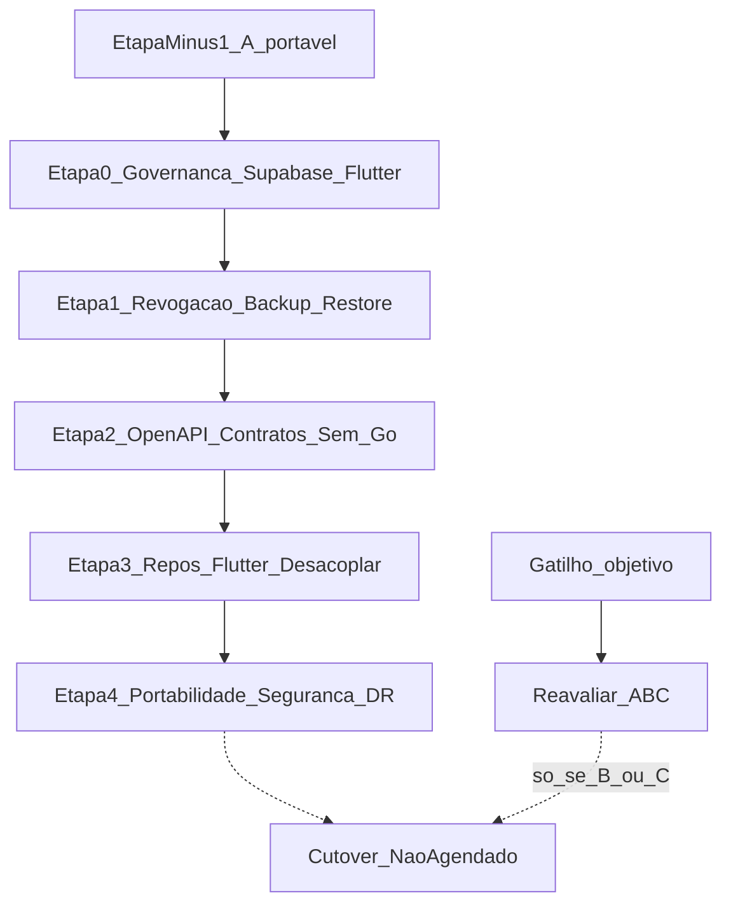

# Phase 11 — Enterprise Pivot (Proposta Canônica, Etapa −1)

**Date:** 2026-07-21
**Status:** Contract complete — Etapa −1 **PASS** (auditoria final H2.1 + ADRs Accepted)
**Commit baseline:** `6e626a6f6314484e7c939e988ff34980351f257b`
**collected_at:** `2026-07-21T21:05:00Z`
**Author (draft):** Migration Owner (execução documental Etapa −1 — A portável)
**Roadmap file:** `docs/governance/roadmap.md` — **NÃO ALTERADO** (arquivo intacto; status de programa abaixo)
**Postura:** pré-revenue; desembolso Supabase atual **R$ 0**

> **Exceção histórica (fundador):** o commit baseline `6e626a6f` mistura artefatos documentais da Etapa −1 com remediação de código AAL2 em `reveal-webhook-signing-secret`. Fica registrado como **exceção autorizada pelo fundador** — não constitui precedente de processo.

## 1. Objetivo

Produzir o **contrato documental** que permite ao Council decidir formalmente **PASS** ou **REVISE** da Etapa −1 sob a direção **A portável**. Esta proposta é a SSOT durável para reviews, veredicto e status do roadmap. Não executa Etapas 0–4, cutover, nem implementação.

## 2. Contexto e baseline

- Stack atual: Supabase (Postgres + Auth + Edge + Storage) + Flutter Wasm.
- Postura pré-revenue: sem tier pago; sem SLA; primeiro piloto ainda não autorizado.
- JWT P0 criptográfico validado (baseline temporário). Residual AAL2 em reveal: **CLOSED** (evidência em `forensic_records/plans/20260721000000_jwt_p0_residual_risks.md`). Residual de revogação pré-`exp`: **decisão arquitetural CLOSED** (ADR-011); implementação = `P-REV-IMPL-01` (Etapa 1).
- Edge Functions reais inventariadas: **22** (prova em inventário; A=B).
- Migrations reais: **377** `.sql` (divergência vs texto histórico “365”).
- Direção escolhida nesta revisão: **A portável** (permanecer Supabase/Flutter; corrigir portabilidade, revogação e DR antes do piloto).
- B (híbrido) e C (self-host Go/React) são **contratos condicionais de saída** — não cancelados, não aprovados, não agendados. Reabertura só por gatilhos objetivos (ADR-010).

## 3. Sequência A portável



| Fase | Escopo | Proibido |
|------|--------|----------|
| −1 (agora) | 8 artefatos + Council | Código, roadmap, INV rewrite, commit |
| 0 | Atualizar governança para A portável; manter regras Supabase/Flutter | Remover regras Flutter/Supabase; Go/React |
| 1 | Revogação server-side (`P-REV-IMPL-01`), backup/restore, ensaio de replay em PostgreSQL padrão | PG16 self-host; Go produtivo |
| 2 | Documentar contratos OpenAPI das superfícies existentes; impedir novos acoplamentos diretos desnecessários | Go produtivo sem novo go/no-go |
| 3 | Desacoplar gradualmente repositories Flutter dos detalhes do provedor | React; reescrita UI |
| 4 | Testes de portabilidade, segurança, restore e gatilhos de reavaliação | Cutover; silenciar scanner |
| Cutover | **Não agendado** | Só nasce após decisão posterior por B ou C |

Etapa 0 só após **PASS** formal da Etapa −1.

## 4. Restrições congeladas

| Restrição | Valor |
|-----------|-------|
| Direção atual | **A portável** (Supabase + Flutter) |
| B / C | Contratos condicionais de saída; sem migração aprovada |
| Schema no pivot | Lift-and-shift se/quando B/C; sem redesign oportunista |
| ALE/KMS layout | Somente pós-cutover (se houver) |
| Flutter + Supabase | Stack de produção até gatilho + go/no-go B/C |
| React | **Fora do plano atual** |
| ADRs 010–013 | **Accepted** (fundador 2026-07-21; Council H2.1 PASS) |
| Roadmap arquivo | Sem edição automática; ver §13 para status de programa |
| JWT P0 | Baseline temporário; não substitui registro de revogação (ADR-011) |

## 5. Alternativas (A Accepted; B/C condicionais)

Ver [ADR-010](../adr/010_exit_supabase.md):

- **A portável** — direção **Accepted** (fundador 2026-07-21).
- **B híbrido** / **C self-host** — contratos condicionais de saída (Accepted como ramp documental); reavaliados apenas por gatilhos objetivos; um gatilho autoriza análise, não migração automática.

## 6. Artefatos SSOT (oito)

| # | Artefato |
|---|----------|
| 1 | Este arquivo — proposta + Council + veredicto |
| 2 | [ADR-010 Exit Supabase / A portável](../adr/010_exit_supabase.md) |
| 3 | [ADR-011 Auth Zero-Trust](../adr/011_auth_zero_trust.md) |
| 4 | [ADR-012 RLS / connection lifecycle](../adr/012_rls_connection_lifecycle.md) |
| 5 | [ADR-013 Strangler Fig](../adr/013_strangler_fig.md) |
| 6 | [Inventário Edge Functions](phase11_edge_functions_inventory.md) |
| 7 | [Threat model](phase11_threat_model.md) |
| 8 | [Parity checklist](phase11_parity_checklist.md) |

## 7. Proibições explícitas nesta etapa

- Implementação Go/React/Postgres self-host, dual-run runtime, cutover
- Alterar `AGENTS.md`, invariantes, agents, skills, scanners, CI-blocks
- Remover ou enfraquecer regras Flutter/Supabase
- Redesign de schema / ALE
- Alterar `docs/governance/roadmap.md`
- Reutilizar aprovação do Council JWT/verifier anterior como aceite desta Etapa −1
- Declarar `PG-REVOCATION PASS` ou restore PASS sem evidência runtime
- Commit

## 8. Matriz de rastreabilidade

| Requirement ID | Requisito/fonte | Etapa plano | Artefato SSOT | Critério de aceitação | Evidência verificável | Owner | Reviewer | Gate bloqueante | Risco se omitido |
|----------------|-----------------|-------------|---------------|----------------------|----------------------|-------|----------|-----------------|------------------|
| R-01 | Proposta canônica e limites | −1 | Esta proposta | Links válidos; sequência A portável | Paths allowlist | Migration Owner | Lead Reviewer | Y | Implementação prematura |
| R-02 | Decisão econômica/técnica | −1 | ADR-010 | A portável + TCO 4×3×12/24 + fontes | Tabelas TCO; P-TCO-01 | Business+Platform Owner | Architect | Y | Migração sem ROI |
| R-02.1 | TCO A portável | −1 | ADR-010 | Desembolso atual R$ 0; lista pública USD | source_date 2026-07-21 | Platform Owner | Architect | Y (Accepted indevido) | Accepted indevido |
| R-03 | Auth/sessões Zero-Trust | −1/1 | ADR-011 | Lifecycle + TTLs + registro PG | ADR-011; PG-REVOCATION contract | Identity Owner | QA/Security | Y | Bypass/sessão zumbi |
| R-03.1 | Residual AAL2 reveal | −1 | ADR-011 + T-26 | CLOSED com evidência | PG-AAL2 Evidence Log | Identity Owner | QA/Security | N (fechado) | Reveal aal1 |
| R-03.2 | Revogação pré-exp (design) | −1 | ADR-011 + T-27 | P-REV-01 design CLOSED | Contrato ADR-011 | Identity Owner | QA/Security | N p/−1; Y piloto via P-REV-IMPL-01 | Sessão zumbi |
| R-03.3 | Revogação runtime | 1 | ADR-011 + parity | P-REV-IMPL-01 + PG-REVOCATION PASS | Testes Etapa 1 | Identity Owner | QA/Security | Y piloto | Sessão zumbi |
| R-04 | Tenant/RLS (condicional B/C) | cond. | ADR-012 | Contrato condicional | Prefácio ADR-012 | Data Platform Owner | QA/Security | N para A | Tenant bleed pós-saída |
| R-05 | Strangler (condicional B/C) | cond. | ADR-013 | Ramp condicional; React fora | Prefácio ADR-013 | Migration Owner | Architect | N para A | Big-bang |
| R-06 | Inventário 1:1 real | −1 | Inventário | A−B=∅; B−A=∅ | §2 inventário; 22 nomes | Edge Runtime Owner | Senior Engineer | Y | Função omitida |
| R-07 | Threat model | −1 | Threat model | Campos completos; T-26 Closed | Tabela T-* | Security Owner | QA/Security | Y | Ameaça sem controle |
| R-08 | Parity gates | −1 | Checklist | CONTRACT COMPLETE vs NOT RUN | PG-* + Evidence Log | QA Owner | Lead Reviewer | Y | Paridade subjetiva |
| R-09 | Validação documental | −1 | Esta proposta §10 | docs-check + LF + links + hash roadmap | §10 outputs | Documentation Owner | Lead Reviewer | Y | Drift |
| R-10 | Reviews independentes | −1 | Esta proposta §11 | Architect, Senior, QA/Security, Lead | Pareceres H2 | Council | Lead Reviewer | Y | Autoaprovação |
| R-11 | Veredicto estrito | −1 | Esta proposta §12 | PASS ou REVISE | §12 | Lead Reviewer | — | Y | PASS indevido |
| R-12 | Roadmap gates | −1 | Esta proposta §13 | Status sem editar roadmap.md | §13 texto | Program Owner | Lead Reviewer | Y | Roadmap prematuro |
| R-13 | DR pré-prod | 1 | ADR-010 + parity | RPO/RTO 24h/24h; restore NOT RUN→PASS | PG-BACKUP/RESTORE/DR | Platform Owner | Lead | Y piloto | Perda de evidência |

### Accountability / escalonamento

| Role | Identidade accountable (papel) | Escalation |
|------|-------------------------------|------------|
| Migration Owner | Programa Phase 11 | Architect → Lead |
| Business+Platform Owner | FinOps + Platform (fundador temporário) | Lead |
| Identity Owner | Auth/security engineering | Security Owner → Lead |
| Data Platform Owner | DB/RLS | QA/Security → Lead |
| Edge Runtime Owner | Edge Functions | Senior → Lead |
| Security Owner | Threat model | QA/Security → Lead |
| QA Owner | Parity gates | Lead |
| Program Owner | Roadmap marcos | Lead |
| Documentation Owner | Validação documental | Lead |

Assumption: o fundador é temporariamente accountable por Product, Finance, Platform, Security e Operations.

## 9. Pendências (decisões vs runtime)

### 9.1 Decisões documentalmente resolvidas nesta revisão H2

| ID | Descrição | Resolução | Artefato |
|----|-----------|-----------|----------|
| P-TCO-01 | TCO decisão A portável | Resolvido para A: desembolso atual R$ 0; **fórmulas** 4×3×12/24 + lista pública USD (volumes `T,E,S,R,G` variáveis, sem invoice inventado); ativação de tier pago = gatilho | ADR-010 |
| P-TCO-02..07 | Capacity/FTE/KMS/migração/thresholds/DR quotes B/C | **Deferred / non-blocking para A**; obrigatórios antes de Approved B ou C | ADR-010 |
| P-DR-01 | RPO/RTO pré-prod | Resolvido como objetivo: **24h/24h, sem SLA**; `<5min/<4h` = prod não aprovado | ADR-010 + parity |
| P-AAL2-01 | AAL2 reveal | **CLOSED** com evidência código + testes + residual plan | ADR-011 + inventário |
| P-REV-01 | Desenho revogação pré-exp | **CLOSED como decisão de arquitetura** (ADR-011) | ADR-011 |

### 9.2 Gates de implementação (bloqueiam piloto; não bloqueiam PASS documental −1 se contrato completo)

| ID | Descrição | Status | Bloqueia |
|----|-----------|--------|----------|
| P-REV-IMPL-01 | Implementar registro PG + wiring Edge/RLS | OPEN | Primeiro piloto; `PG-REVOCATION PASS` |
| PG-REVOCATION | Runtime revogação pré-`exp` | CONTRACT COMPLETE / runtime **NOT RUN** | Primeiro piloto |
| PG-BACKUP | Dump diário off-site (+ Storage classificado) | NOT RUN | Primeiro piloto |
| PG-RESTORE | Restore exercitado ≤24h | NOT RUN | Primeiro piloto |
| PG-DR | Continuity drill 24h/24h | NOT RUN | Primeiro piloto |
| P-PERF-01 | Baseline p95 dual-run | Deferred (só se B/C) | Cutover B/C |
| T-28 / F-06 | `ingest-omnitracs` verify_jwt gap | Open (track pós-PASS −1) | Não bloqueia −1 documental |

## 10. Validação documental

| Check | Comando/método | Resultado | Timestamp UTC |
|-------|----------------|-----------|---------------|
| Artefatos presentes | `Test-Path` × 8 | OK (8/8) | 2026-07-21T21:15:00Z |
| `make docs-check` | `make docs-check` | OK — CI Blocks 22 + Lessons 15 sync | 2026-07-21T21:35:00Z (recheck) |
| LF / `git diff --check` | CRLF + whitespace | CRLF=0; diff --check limpo (ADRs) | 2026-07-21T21:30:00Z |
| Links locais | paths relativos siblings | Destinos dos 8 artefatos existem | 2026-07-21T21:15:00Z |
| Inventário A=B | recontagem `index.ts` dirs | count=22; A−B=∅ | 2026-07-21T21:35:00Z (recheck) |
| Roadmap hash estável | `git hash-object docs/governance/roadmap.md` | `7991220efb28a6520e76756400a21add42e1c007` (**arquivo não editado**) | 2026-07-21T21:35:00Z |
| Status ADR | grep `**Status:**` | 010–013 = **Accepted** | 2026-07-21T21:35:00Z |
| TBD bloqueante −1 | matriz §9.1 | Decisões P-TCO-01/P-DR-01/P-AAL2/P-REV fechadas; runtime NOT RUN (piloto) | 2026-07-21T21:35:00Z |
| Evidência AAL2 | residual + reveal tests | CLOSED / PG-AAL2 PASS (Edge) | 2026-07-21T21:35:00Z |
| Council H2.1 | Architect + Senior + QA/Security | **PASS** | 2026-07-21T21:30:00Z |
| Lead Reviewer | PASS_DOCUMENTAL | Sem auto-Accepted; fundador promoveu ADRs | 2026-07-21T21:30:00Z |
| Fundador ADRs | Confirmação formal H2.1 | Proposed → Accepted (010–013); residual JWT ratificado | 2026-07-21T21:22:00Z |
| Fundador sync pivot | Autorização exclusiva desta sincronização | Auditoria final + PASS −1 + READY_TO_ADD_PHASE_11 (sem editar roadmap.md) | 2026-07-21T21:35:00Z |

## 11. Registro do Council + auditoria final

> Council H2.1 **PASS**. Fundador aceitou ADR-010…013 (2026-07-21). Lead não substitui autoridade humana. Residual JWT sync (`DOC-RESIDUAL-SYNC-01`) ratificado excepcionalmente pelo fundador.

| Persona | Agente/ID | Hash revisão | Data UTC | Veredicto | Findings |
|---------|-----------|--------------|----------|-----------|----------|
| Architect | [H2](a3bd63a3-d095-46c5-bff4-0c63ebc7f744) → [H2.1](3242e602-17d6-448e-b7e7-9ef9d8783843) | H2.1 | 2026-07-21 | **PASS** | H2 HIGH ADR-012 namespace (corrigido) |
| Senior Engineer | idem | H2.1 | 2026-07-21 | **PASS** | H2 BLOCKER wiring RLS (corrigido ADR-011) |
| QA/Security | idem | H2.1 | 2026-07-21 | **PASS** | H2 HIGH residual sync (corrigido + ratificado) |
| Lead Reviewer | [Lead](dfb18e7f-cb10-4d5f-8355-05c5bff5729f) | H2.1 final | 2026-07-21 | **PASS_DOCUMENTAL** | Sem promoção Accepted pelo Lead |
| Fundador | — | H2.1 ADRs | 2026-07-21 | **Accepted ADRs 010–013** | Só status/decision record nos ADRs |
| Fundador | — | Sync pivot | 2026-07-21 | **Autoriza auditoria + PASS −1 + READY_TO_ADD** | Sem editar `roadmap.md`; sem Etapa 0/commit/impl |

Histórico H1: **REVISE**. H2 → correções → H2.1: `COUNCIL_H2_1: PASS`.

## 12. Veredicto da Etapa −1

```text
ETAPA -1 STATUS: PASS
```

**Gates satisfeitos:**
1. Oito artefatos coerentes com A portável.
2. ADR-010…013 **Accepted** (fundador) após Council H2.1 PASS.
3. P-TCO-01 / P-DR-01 / P-AAL2-01 / P-REV-01 (design) documentalmente resolvidos; runtime piloto permanece gated (`P-REV-IMPL-01`, PG-BACKUP/RESTORE/DR).
4. Inventário A=B (22); `make docs-check` OK; roadmap.md **não editado**.
5. Zero TBD bloqueante para o contrato −1.

**Não autorizado por este PASS:** Etapa 0, commit, implementação, edição de `docs/governance/roadmap.md`.

## 13. Roadmap gates (sem editar roadmap.md)

```text
ROADMAP STATUS: READY_TO_ADD_PHASE_11

ROADMAP ACTION:
Arquivo docs/governance/roadmap.md permanece INTACTO (hash 7991220efb28a6520e76756400a21add42e1c007).
Status de programa: READY_TO_ADD_PHASE_11 — autorização para *propor* inclusão da estrutura Phase 11 no roadmap em missão futura.
Nenhuma edição automática do arquivo. Etapa 0 / commit / implementação: NÃO autorizados neste registro.
```

## 14. Limites por fase (A portável)

| Fase | Permitido | Proibido |
|------|-----------|----------|
| −1 (**PASS**) | Contrato documental fechado; ADRs Accepted | Código, editar roadmap.md, INV rewrite, commit (neste registro) |
| 0 | Governança A portável; dual-stack rules preservadas | Remover Flutter/Supabase; Go/React — **não autorizada ainda** |
| 1 | Revogação PG + backup/restore + replay drill | Self-host PG16; Go produtivo |
| 2 | OpenAPI das superfícies existentes | Go produtivo sem go/no-go |
| 3 | Desacoplar repos Flutter do provedor | React |
| 4 | Portabilidade / segurança / restore / gatilhos | Cutover automático |
| Cutover | Não agendado | Desligar legado sem decisão B/C |
