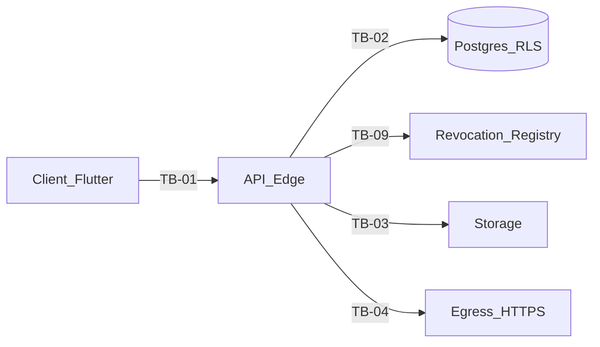

# Phase 11 — Threat Model (Etapa −1)

**Date:** 2026-07-21
**Status:** Proposed (contrato documental; não implica migração iniciada)
**Commit baseline:** `6e626a6f6314484e7c939e988ff34980351f257b`
**Direção:** A portável
**SSOT siblings:** [phase11_enterprise_pivot.md](phase11_enterprise_pivot.md), [phase11_edge_functions_inventory.md](phase11_edge_functions_inventory.md), [phase11_parity_checklist.md](phase11_parity_checklist.md), [ADR-010](../adr/010_exit_supabase.md), [ADR-011](../adr/011_auth_zero_trust.md), [ADR-012](../adr/012_rls_connection_lifecycle.md), [ADR-013](../adr/013_strangler_fig.md)
**Baseline auth:** JWT P0 Edge/Supabase Auth + contrato ADR-011 (**Accepted**). Residual: `forensic_records/plans/20260721000000_jwt_p0_residual_risks.md`. Specs Etapa 0: [phase11_etapa0_executable_specs.md](phase11_etapa0_executable_specs.md).

## 1. Escalas

| Escala | Baixa | Média | Alta | Crítica |
|--------|-------|-------|------|---------|
| **Probabilidade** | Requer privilégios internos + falha rara | Explorável com conhecimento público + esforço | Explorável rotineiramente na superfície pública | Automatizável / massivo |
| **Impacto** | Degradação local sem PII/ledger | PII limitada ou DoS local | Cross-tenant leak, forge de evidência, ou comprometimento de segredo org | Ledger forjado, SA completo, ou breach multi-tenant sistêmico |
| **Severidade** | max(impacto, probabilidade) com elevação se gate binário INV-* | | | |

Gates binários (zero falha tolerada): autenticação bypass, tenant/pool bleed, principal híbrido, AAL2 no reveal, revogação inválida, mutação append-only, INV-26, INV-28.

## 2. Ativos

| ID | Ativo | Classificação |
|----|-------|---------------|
| A-01 | Ledger SLA / financeiro | Crítico / append-only |
| A-02 | Evidências (storage + hashes SHA-256) | Crítico |
| A-03 | Segredos HMAC por org / webhook signing keys | Crítico |
| A-04 | Sessões e tokens (access/refresh/portal/Telegram) | Crítico |
| A-05 | Telemetria bruta e fatos canônicos | Alto |
| A-06 | Identidade SuperAdmin / impersonation sessions | Crítico |
| A-07 | Chaves de assinatura JWT / JWKS | Crítico |
| A-08 | Backups e dumps (+ objetos Storage classificados) | Crítico |
| A-09 | Logs/telemetria de observabilidade | Médio |
| A-10 | Contratos OpenAPI e feature flags | Médio |

## 3. Atores

| ID | Ator |
|----|------|
| X-Anon | Anônimo na internet |
| X-TenantUser | Usuário autenticado de um tenant |
| X-TenantAdmin | TENANT_ADMIN |
| X-Auditor | AUDITOR |
| X-Portal | Portador de token de portal (sem JWT) |
| X-Provider | Integrador GPS (API key) |
| X-SA | SuperAdmin |
| X-Insider | Operador com break_glass / migrator |
| X-Supply | Dependência/CI comprometida |
| X-MaliciousTenant | Tenant malicioso atacando outro tenant |

## 4. Trust boundaries

| ID | Boundary |
|----|----------|
| TB-01 | Cliente (Flutter) ↔ API (Edge hoje; Go só se B/C) |
| TB-02 | API ↔ Postgres (RLS JWT hoje; SET LOCAL se B/C) |
| TB-03 | API ↔ Storage |
| TB-04 | API ↔ Internet egress |
| TB-05 | Gateway JWT vs funções `verify_jwt=false` |
| TB-06 | Cron/service_role ↔ workers |
| TB-07 | Dual-run shadow (**condicional B/C**) |
| TB-08 | Break-glass / migrator ↔ app_user |
| TB-09 | Registro de revogação PG ↔ Edge / Data API |

## 5. Fluxos cobertos

Auth/session; ingest HMAC/API-key; evidence upload/serve; portal token; webhook outbound; Telegram ingress; tenant OCC reads; SuperAdmin proxy; impersonation; backup/restore pré-prod; dual-run shadow (condicional).

## 6. Ameaças

| ID | Categoria | Cenário | Ativo | Boundary | Precondição | Impacto | Prob. | Sev. | Preventivo | Detectivo | Teste verificável | Residual | Owner | Status | Gate |
|----|-----------|---------|-------|----------|-------------|---------|-------|------|------------|-----------|-------------------|----------|-------|--------|------|
| T-01 | Spoofing | JWT forjado / `alg=none` / algorithm confusion | A-04,A-07 | TB-01 | Verificador permissivo | Crítico | Média | Crítica | Allowlist alg; JWKS; fail-closed | Alertas de falha | Testes crypto JWT | Chave comprometida | Identity Owner | Open | PG-AUTH |
| T-02 | Tampering | Claims `organization_id`/`role`/`aal` alterados | A-04 | TB-01 | Assinatura fraca | Crítico | Média | Crítica | Assinatura + validação tipada | Audit rejeições | Tamper tests | N/A se fail-closed | Identity Owner | Open | PG-AUTH |
| T-03 | Spoofing | Roubo de cookie de sessão | A-04 | TB-01 | XSS ou malware | Alto | Média | Alta | HttpOnly Secure SameSite; CSP | Anomalia sessão | CSRF suite | Device compromise | Identity Owner | Open | PG-SESSION |
| T-04 | Replay | Replay de access/refresh token | A-04 | TB-01 | Token interceptado | Alto | Média | Alta | TTL 5m; refresh rotation; registro PG | Replay alert | Replay pós-logout | Janela até P-REV-IMPL-01 | Identity Owner | Open | PG-REVOCATION |
| T-05 | Elevation | Refresh theft + rotation race | A-04 | TB-01 | Roubo de refresh | Crítico | Média | Crítica | Rotation atômica; reuse revoga família incl. sucessor | Alert reuse | Teste reuse refresh | Offline steal | Identity Owner | Open | PG-REVOCATION |
| T-06 | Spoofing | CSRF em mutação cookie-auth | A-01,A-02 | TB-01 | SameSite frouxo | Alto | Média | Alta | CSRF bound; SameSite=Strict | Log CSRF fail | Mutação sem CSRF → 403 | Browser bugs | Identity Owner | Open | PG-AUTH |
| T-07 | XSS | XSS rouba CSRF ou exfiltra UI | A-04,A-09 | TB-01 | Sink não sanitizado | Alto | Média | Alta | CSP; sem HTML raw | CSP report | XSS fixture | Extensão browser | Web Owner | Open | PG-OBSERVABILITY |
| T-08 | Elevation | Tenant bleed via RLS fraco | A-01,A-02 | TB-02 | Policy errada | Crítico | Média | Crítica | Org predicate; INV-2 | Query audit | pgTAP + Red Team | Bug policy nova | Data Platform Owner | Open | PG-RLS |
| T-09 | Elevation | Pool bleed (só se B/C SET LOCAL) | A-01 | TB-02 | SET session-level | Crítico | Média | Crítica | Só SET LOCAL; txn pool | Metric mismatch | Pool size=1 A↔B | Condicional B/C | Data Platform Owner | Conditional_B_C | PG-POOL-BLEED |
| T-10 | Spoofing | Ingest API key vazada / replay | A-05 | TB-01 | Key leak | Alto | Média | Alta | Key hash; rate limit; idempotency | Alert volume | Spoof/replay tests | Key theft | Ingest Owner | Open | PG-INGEST |
| T-11 | Tampering | HMAC INV-28 quebrado | A-03 | TB-02 | Master key misuse | Crítico | Baixa | Crítica | Segredo por org | Verify fail metrics | HMAC negative | Insider | Crypto Owner | Open | PG-HMAC |
| T-12 | Information | Evidence oracle cross-org | A-02 | TB-01 | 403 vs 404 | Médio | Alta | Alta | INV-26 parity 404 | Diff status | Wrong-org vs missing | Timing residual | Evidence Owner | Open | PG-INV26 |
| T-13 | SSRF | Worker webhook IP interno | A-10 | TB-04 | Allowlist ausente | Alto | Média | Alta | Block private ranges | Egress deny | SSRF suite | DNS rebinding | Webhook Owner | Open | PG-WEBHOOK |
| T-14 | Spoofing | Abuso signed URL / upload | A-02 | TB-03 | Token longo | Alto | Média | Alta | TTL curto; path org | Upload anomaly | Portal abuse tests | Share link | Evidence Owner | Open | PG-EVIDENCE |
| T-15 | Spoofing | Webhook spoofing/replay | A-01,A-03 | TB-04 | Sem HMAC/ts | Alto | Média | Alta | HMAC+timestamp+nonce | Delivery log | Replay webhook | Clock skew | Webhook Owner | Open | PG-WEBHOOK |
| T-16 | Information | Secrets em logs/Sentry | A-03,A-09 | TB-01 | Log excessivo | Alto | Média | Alta | Redaction; deny-list | Secret scan CI | Assert absent | Manual debug | Observability Owner | Open | PG-AUDIT |
| T-17 | Elevation | SuperAdmin sem AAL2 | A-06 | TB-01 | MFA skip | Crítico | Baixa | Crítica | AAL2 obrigatório | SA access log | AAL2 PBT | Dev bypass | SA Owner | Open | PG-AAL2 |
| T-18 | Elevation | Impersonation sem audit/revoke | A-06 | TB-01 | Session órfã | Crítico | Média | Crítica | TTL 30m; actor; revoke | Impersonation alerts | Issue/revoke suite | Operator abuse | SA Owner | Open | PG-IMPERSONATION |
| T-19 | Elevation | Break-glass sem reason/audit | A-01 | TB-08 | Role ampla | Crítico | Baixa | Crítica | Time-box; audit | Pager on use | Break-glass drill | Insider | Data Platform Owner | Open | PG-AUDIT |
| T-20 | Tampering | Supply chain CI/deps | A-07,A-10 | — | Compromisso deps | Crítico | Baixa | Crítica | Lockfiles; Trivy | SBOM drift | gosec/Trivy | Zero-day | Platform Owner | Open | PG-OBSERVABILITY |
| T-21 | DoS | Exhaustion ingest/portal | A-05 | TB-01 | Sem rate limit | Médio | Alta | Alta | Rate limit Auth+app | 429 metrics | Load/chaos | Volumetric L3 | Platform Owner | Open | PG-CAPACITY |
| T-22 | Tampering | Shadow dual-run side effect dup | A-01 | TB-07 | Dois writers | Alto | Média | Alta | Shadow read-only; single owner | Divergence detect | Dual-run write test | **Condicional B/C** | Migration Owner | Conditional_B_C | PG-DUAL-RUN |
| T-23 | Information | Backup restore / plaintext / Storage omitido | A-08 | TB-08 | Sem dump off-site / blobs fora | Crítico | Média | Crítica | Dump diário cifrado; Storage classificado separado; restore ≤24h | Restore audit | PG-BACKUP/RESTORE drill | Insider; Free sem daily auto | Platform Owner | Open | PG-BACKUP / PG-RESTORE / PG-DR |
| T-24 | Elevation | Principal híbrido tenant+SA | A-06 | TB-01 | Claims mistos | Crítico | Média | Crítica | Separação issuer/role | Reject hybrid | Hybrid claim test | Config error | Identity Owner | Open | PG-AUTH |
| T-25 | Spoofing | Telegram secret ausente/fraco | A-02,A-05 | TB-05 | Secret leak | Alto | Média | Alta | Constant-time compare | Invalid secret spikes | Webhook auth tests | Platform trust | Telegram Owner | Open | PG-INGEST |
| T-26 | Elevation | Reveal sem AAL2 | A-03 | TB-01 | aal1 TENANT_ADMIN | Alto | — | — | `REVEAL_REQUIRE_AAL2=true` | Audit reveal | Unit aal1→deny | N/A | Identity Owner | **Closed** | PG-AAL2 |
| T-27 | Elevation | Revogação pré-`exp` ausente (getClaims) | A-04 | TB-09 | Logout/ban até exp | Alto | Alta | Alta | Registro PG (ADR-011); P-REV-IMPL-01 | Post-revoke attempts | Revoke then call Edge+Data API | **Design decided; impl pending** | Identity Owner | **Open/High — design decided, implementation pending** | PG-REVOCATION |
| T-28 | Spoofing | `ingest-omnitracs` verify_jwt gap | A-05 | TB-05 | verify_jwt default | Médio | Alta | Alta | `verify_jwt=false` parity sascar | Config drift alert | Config parity check | Deploy drift | Ingest Owner | Open | PG-INGEST |
| T-29 | Elevation | Dual-run service_role vs app_user | A-01 | TB-07 | Dual-run ativo | Crítico | Média | Crítica | Side-effect owner único | Audit cross-path | SPEC:dual_run_privilege_matrix | **Condicional B/C** | Migration Owner | Conditional_B_C | PG-DUAL-RUN |
| T-30 | Spoofing | Portal routes JWT gateway default | A-02 | TB-05 | verify_jwt default | Alto | Alta | Alta | verify_jwt=false onde auth≠JWT | 401/404 parity | Config+contract tests | Deploy drift | Evidence Owner | Open | PG-EVIDENCE |
| T-31 | Elevation | Staleness de revogação / cache positivo authz | A-04 | TB-09 | Cache permissivo | Alto | Média | Alta | Sem cache positivo; staleness=0 pós-commit | Metric stale allow | Assert deny imediato | Misconfig cache | Identity Owner | Open | PG-REVOCATION |
| T-32 | DoS / Availability | PG ou Auth indisponível → allow | A-04 | TB-09 | Fallback permissivo | Crítico | Baixa | Crítica | Fail-closed obrigatório | Deny spikes | Chaos store/Auth down | Ops | Identity Owner | Open | PG-REVOCATION / PG-AUTH |

## 7. Superfícies

| Superfície | Exemplos | Ameaças primárias |
|------------|----------|-------------------|
| Pública / token | portal-*, ingest-*, telegram-webhook | T-10,T-14,T-21,T-25,T-28 |
| Tenant autenticada | evidence, reveal-*, OCC | T-01..T-07,T-12,T-26(Closed),T-27,T-31,T-32 |
| Workers/cron | dispatch-*, notify-*, revoke-user-sessions | T-13,T-15 |
| SuperAdmin | super-admin-proxy, impersonation | T-17,T-18,T-24 |
| Ops / DR | backups, dumps, Storage copy | T-19,T-20,T-23 |
| Dual-run (B/C only) | shadow paths | T-22,T-29 |

## 8. Critério de completude

- Toda ameaça tem ID, owner, teste, residual e gate.
- T-26 Closed com evidência; T-27 Open/High até runtime; T-23/T-31/T-32 cobrem DR e revogação A portável.
- T-09/T-22/T-29 condicionais a B/C — **não** bloqueiam A.
- Sem inventar SLO numérico; budgets em checklist.

**Owner:** Security Owner
**Reviewer:** QA/Security (Council)
