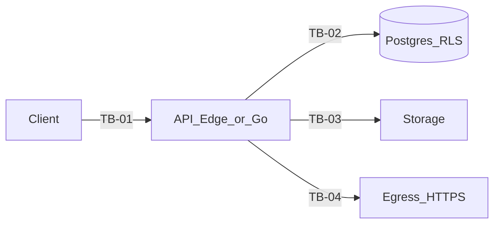

# Phase 11 — Threat Model (Etapa −1)

**Date:** 2026-07-21  
**Status:** Proposed (contrato documental; não implica migração iniciada)  
**SSOT siblings:** [phase11_enterprise_pivot.md](phase11_enterprise_pivot.md), [phase11_edge_functions_inventory.md](phase11_edge_functions_inventory.md), [phase11_parity_checklist.md](phase11_parity_checklist.md), [ADR-010](../adr/010_exit_supabase.md), [ADR-011](../adr/011_auth_zero_trust.md), [ADR-012](../adr/012_rls_connection_lifecycle.md), [ADR-013](../adr/013_strangler_fig.md)  
**Baseline auth:** JWT P0 Edge/Supabase Auth é temporário; auth alvo é ADR-011 (Proposed). Residual: `forensic_records/plans/20260721000000_jwt_p0_residual_risks.md`.

## 1. Escalas

| Escala | Baixa | Média | Alta | Crítica |
|--------|-------|-------|------|---------|
| **Probabilidade** | Requer privilégios internos + falha rara | Explorável com conhecimento público + esforço | Explorável rotineiramente na superfície pública | Automatizável / massivo |
| **Impacto** | Degradação local sem PII/ledger | PII limitada ou DoS local | Cross-tenant leak, forge de evidência, ou comprometimento de segredo org | Ledger forjado, SA completo, ou breach multi-tenant sistêmico |
| **Severidade** | max(impacto, probabilidade) com elevação se gate binário INV-* | | | |

Gates binários (zero falha tolerada): autenticação bypass, tenant/pool bleed, principal híbrido, AAL2 no reveal, revogação inválida, mutação append-only, INV-26, INV-28.

## 2. Ativos

| ID | Ativo | Classificação |
|----|-------|---------------|
| A-01 | Ledger SLA / financeiro (`sla_audit_ledger_v2` e correlatos) | Crítico / append-only |
| A-02 | Evidências (storage + hashes SHA-256) | Crítico |
| A-03 | Segredos HMAC por org / webhook signing keys | Crítico |
| A-04 | Sessões e tokens (access/refresh/portal/Telegram) | Crítico |
| A-05 | Telemetria bruta e fatos canônicos | Alto |
| A-06 | Identidade SuperAdmin / impersonation sessions | Crítico |
| A-07 | Chaves de assinatura JWT / JWKS | Crítico |
| A-08 | Backups e dumps | Crítico |
| A-09 | Logs/telemetria de observabilidade | Médio (risco de vazamento) |
| A-10 | Contratos OpenAPI e feature flags | Médio |

## 3. Atores

| ID | Ator |
|----|------|
| X-Anon | Anônimo na internet |
| X-TenantUser | Usuário autenticado de um tenant |
| X-TenantAdmin | TENANT_ADMIN |
| X-Auditor | AUDITOR |
| X-Portal | Portador de token de portal (sem JWT) |
| X-Provider | Integrador GPS (API key) |
| X-SA | SuperAdmin |
| X-Insider | Operador com break_glass / migrator |
| X-Supply | Dependência/CI comprometida |
| X-MaliciousTenant | Tenant malicioso atacando outro tenant |

## 4. Trust boundaries

| ID | Boundary |
|----|----------|
| TB-01 | Cliente (Flutter/React) ↔ API (Edge hoje / Go candidato) |
| TB-02 | API ↔ Postgres (RLS / SET LOCAL) |
| TB-03 | API ↔ Storage |
| TB-04 | API ↔ Internet egress (webhooks, Resend, ReceitaWS, Telegram, Sentry) |
| TB-05 | Gateway JWT vs funções `verify_jwt=false` |
| TB-06 | Cron/service_role ↔ workers |
| TB-07 | Dual-run shadow (stack antiga ↔ stack nova) |
| TB-08 | Break-glass / migrator ↔ app_user |

## 5. Fluxos cobertos

Auth/session; ingest HMAC/API-key; evidence upload/serve; portal token; webhook outbound; Telegram ingress; tenant OCC reads; SuperAdmin proxy; impersonation; dual-run shadow.

## 6. Ameaças

| ID | Categoria | Cenário | Ativo | Boundary | Precondição | Impacto | Prob. | Sev. | Preventivo | Detectivo | Teste verificável | Residual | Owner | Status | Gate |
|----|-----------|---------|-------|----------|-------------|---------|-------|------|------------|-----------|-------------------|----------|-------|--------|------|
| T-01 | Spoofing | JWT forjado / `alg=none` / algorithm confusion | A-04,A-07 | TB-01 | Verificador permissivo | Crítico | Média | Crítica | Allowlist alg; JWKS; fail-closed | Alertas de falha de verificação | Testes criptográficos + contract JWT | Chave comprometida | Identity Owner | Open | PG-AUTH |
| T-02 | Tampering | Claims `organization_id`/`role`/`aal` alterados | A-04 | TB-01 | Assinatura fraca | Crítico | Média | Crítica | Assinatura + validação tipada | Audit de rejeições | Tamper payload/signature | N/A se fail-closed | Identity Owner | Open | PG-AUTH |
| T-03 | Spoofing | Roubo de cookie de sessão | A-04 | TB-01 | XSS ou malware | Alto | Média | Alta | HttpOnly Secure SameSite; CSP | Anomalia de sessão | Roubo simulado + CSRF suite | Device compromise | Identity Owner | Open | PG-SESSION |
| T-04 | Replay | Replay de access/refresh token | A-04 | TB-01 | Token interceptado | Alto | Média | Alta | TTL curto; refresh rotation; jti denylist | Replay detection alert | Replay após logout/rotate | Janela TTL | Identity Owner | Open | PG-REVOCATION |
| T-05 | Elevation | Refresh-token theft + rotation race | A-04 | TB-01 | Roubo de refresh | Crítico | Média | Crítica | Rotation + reuse detection invalida família | Alert reuse | Teste reuse refresh | Offline steal sem detect até reuse | Identity Owner | Open | PG-REVOCATION |
| T-06 | Spoofing | CSRF em mutação cookie-auth | A-01,A-02 | TB-01 | SameSite frouxo / sem CSRF | Alto | Média | Alta | CSRF token bound à sessão; SameSite=Strict | Log CSRF fail | Mutação sem CSRF → 403 | Browser bugs | Identity Owner | Open | PG-AUTH |
| T-07 | XSS | XSS rouba CSRF ou exfiltra UI | A-04,A-09 | TB-01 | Sink não sanitizado | Alto | Média | Alta | CSP; sem HTML raw; React escape | CSP report | XSS fixture | Extensão browser | Web Owner | Open | PG-OBSERVABILITY |
| T-08 | Elevation | Tenant bleed via RLS fraco | A-01,A-02 | TB-02 | Policy errada / BYPASSRLS | Crítico | Média | Crítica | app_user sem BYPASSRLS; org predicate | Query audit | pgTAP + Red Team A/B | Bug em policy nova | Data Platform Owner | Open | PG-RLS |
| T-09 | Elevation | Pool bleed: conexão reutilizada com tenant anterior | A-01 | TB-02 | SET session-level ou reset falho | Crítico | Média | Crítica | Só SET LOCAL; txn pool; discard on panic | Metric tenant mismatch | Pool size=1 A↔B adversarial | Driver bug | Data Platform Owner | Open | PG-POOL-BLEED |
| T-10 | Spoofing | Ingest com API key vazada / replay | A-05 | TB-01 | Key leak | Alto | Média | Alta | Key hash; rate limit; idempotency | Alert volume | Spoof/replay ingest tests | Key theft até rotação | Ingest Owner | Open | PG-INGEST |
| T-11 | Tampering | HMAC INV-28 quebrado / segredo global | A-03 | TB-02 | Master key misuse | Crítico | Baixa | Crítica | Segredo por org; rotação append-only | Verify fail metrics | HMAC negative tests | Insider com master | Crypto Owner | Open | PG-HMAC |
| T-12 | Information | Evidence oracle (existência cross-org) | A-02 | TB-01 | 403 vs 404 distintos | Médio | Alta | Alta | INV-26 parity 404 | Diff status codes | Wrong-org vs missing | Timing side-channel residual | Evidence Owner | Open | PG-INV26 |
| T-13 | SSRF | Worker webhook para IP interno | A-10 | TB-04 | URL allowlist ausente | Alto | Média | Alta | DNS/IP lock; block private ranges | Egress deny logs | SSRF suite | DNS rebinding residual | Webhook Owner | Open | PG-WEBHOOK |
| T-14 | Spoofing | Abuso de signed URL / upload token | A-02 | TB-03 | Token longo / path livre | Alto | Média | Alta | TTL curto; path prefix org; magic+hash | Upload anomaly | Portal token abuse tests | Share link social | Evidence Owner | Open | PG-EVIDENCE |
| T-15 | Spoofing | Webhook spoofing/replay inbound ou forge outbound | A-01,A-03 | TB-04 | Sem HMAC/timestamp | Alto | Média | Alta | HMAC+timestamp+nonce; idempotency | Delivery log integrity | Replay webhook | Clock skew window | Webhook Owner | Open | PG-WEBHOOK |
| T-16 | Information | Secrets em logs/Sentry | A-03,A-09 | TB-01 | Log excessivo | Alto | Média | Alta | Redaction; deny-list tokens | Secret scan CI | Inject token assert absent | Manual debug | Observability Owner | Open | PG-AUDIT |
| T-17 | Elevation | SuperAdmin sem AAL2 / lockout bypass | A-06 | TB-01 | MFA skip em prod | Crítico | Baixa | Crítica | AAL2 obrigatório; lockout RPC | SA access log | AAL2 PBT + lockout | Dev bypass leak | SA Owner | Open | PG-AAL2 |
| T-18 | Elevation | Impersonation sem auditoria/revogação | A-06 | TB-01 | Session órfã | Crítico | Média | Crítica | TTL; audit; revoke; real vs acting id | Impersonation alerts | Issue/revoke suite | Operator abuse | SA Owner | Open | PG-IMPERSONATION |
| T-19 | Elevation | Break-glass sem reason/audit | A-01 | TB-08 | Role ampla | Crítico | Baixa | Crítica | Time-box; reason; append-only audit | Pager on use | Break-glass drill | Insider trusted | Data Platform Owner | Open | PG-AUDIT |
| T-20 | Tampering | Supply chain CI/deps | A-07,A-10 | TB-07 | Compromisso npm/go mod | Crítico | Baixa | Crítica | Lockfiles; provenance; Trivy | SBOM drift | gosec/Trivy gate | Zero-day | Platform Owner | Open | PG-OBSERVABILITY |
| T-21 | DoS | Exhaustion ingest/portal/Telegram | A-05 | TB-01 | Sem rate limit | Médio | Alta | Alta | Rate limit; quotas; backpressure | 429 metrics | Load/chaos scripts | Volumetric L3 | Platform Owner | Open | PG-CAPACITY |
| T-22 | Tampering | Shadow dual-run escreve side effect duplicado | A-01 | TB-07 | Dois writers | Alto | Média | Alta | Shadow read-only; single side-effect owner | Divergence + duplicate detect | Dual-run write test | Misconfig flag | Migration Owner | Open | PG-DUAL-RUN |
| T-23 | Information | Backup restore cross-tenant / plaintext | A-08 | TB-08 | Backup sem criptografia | Crítico | Baixa | Crítica | Encryption at rest; access control | Restore audit | Restore drill | Insider | Platform Owner | Open | PG-BACKUP |
| T-24 | Elevation | Principal híbrido tenant+SA | A-06 | TB-01 | Claims mistos | Crítico | Média | Crítica | Separação de issuer/role allowlist | Reject hybrid metric | Hybrid claim test | Config error | Identity Owner | Open | PG-AUTH |
| T-25 | Spoofing | Telegram secret ausente/fraco | A-02,A-05 | TB-05 | Secret leak | Alto | Média | Alta | Constant-time compare; rotate | Invalid secret spikes | Webhook auth tests | Telegram platform trust | Telegram Owner | Open | PG-INGEST |
| T-26 | Elevation | `reveal-webhook-signing-secret` sem AAL2 (residual P0) | A-03 | TB-01 | aal1 TENANT_ADMIN | Alto | Alta | Alta | Exigir AAL2 (ADR-011); gate PG-AAL2 | Audit reveal | Unit aal1→deny | Até remediação Edge | Identity Owner | Open | PG-AAL2 |
| T-27 | Elevation | Revogação pré-`exp` ausente com getClaims (residual) | A-04 | TB-01 | Logout/ban até exp | Alto | Alta | Alta | Session store + denylist/jti; TTL curto | Post-revoke access attempts | Revoke then call API | Access até deploy auth alvo | Identity Owner | Open | PG-REVOCATION |
| T-28 | Spoofing | `ingest-omnitracs` gateway JWT default vs API-key (config gap) | A-05 | TB-05 | verify_jwt=true default | Médio | Alta | Alta | Obrigatório: `verify_jwt=false` parity com `ingest-sascar` no `config.toml` (fail-closed; sem “só documentar override”) | 401 spikes / config drift alert | Config parity check + deploy gate | Deploy drift residual | Ingest Owner | Open | PG-INGEST |
| T-29 | Elevation | Dual-run: Edge `service_role` (BYPASSRLS) coexiste com Go `app_user` na mesma DB | A-01 | TB-07 | Dual-run ativo | Crítico | Média | Crítica | Side-effect owner único; paths Edge sensíveis freeze/flag; Go nunca assume service_role para tenant reads | Audit cross-path; deny dual writer | SPEC:dual_run_privilege_matrix | Misconfig flag | Migration Owner | Open | PG-DUAL-RUN |
| T-30 | Spoofing | Portal-token routes com gateway JWT default-true (`portal-*`, `get-justification-upload-url`, `dispute-portal-evidence`) | A-02 | TB-05 | verify_jwt default | Alto | Alta | Alta | Declarar `verify_jwt=false` onde auth ≠ JWT **ou** mover auth para gateway explícito; anti-oracle INV-26 | 401/404 parity metrics | Config+contract tests | Deploy drift | Evidence Owner | Open | PG-EVIDENCE |

## 7. Superfícies públicas vs administrativas

| Superfície | Exemplos | Ameaças primárias |
|------------|----------|-------------------|
| Pública / token | portal-*, get-justification-upload-url, ingest-*, telegram-webhook | T-10,T-14,T-21,T-25,T-28 |
| Tenant autenticada | evidence proxies, verify-ledger-hmac, reveal-*, OCC reads | T-01..T-07,T-12,T-26 |
| Workers/cron | dispatch-*, notify-sla-breach, revoke-user-sessions | T-13,T-15,T-22 |
| SuperAdmin | super-admin-proxy, impersonation | T-17,T-18,T-24 |
| Ops | break_glass, migrator, backups | T-19,T-20,T-23 |

## 8. Critério de completude deste artefato

- Toda ameaça tem ID, owner, teste, residual e gate.
- Residuais JWT P0 (T-26, T-27), config ingest (T-28), dual-run privilege (T-29) e portal gateway (T-30) estão explícitos.
- Nenhum número de capacidade/SLO inventado; budgets quantitativos ficam `pending_baseline` no checklist até medição.

**Owner deste documento:** Security Owner  
**Reviewer:** QA/Security (Council)
