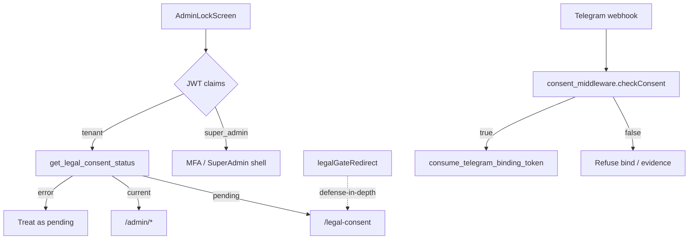

# Architecture Plan: Legal Gate & Terms of Use (LGPD)

**Status:** AS-BUILT / COUNCIL-RATIFIED — documents the shipped package; not a greenfield design.
**Migration:** `supabase/migrations/20260922000001_legal_gate_lgpd.sql`
**Companions:**
- UAT (functional SSOT): `forensic_records/plans/20260922000001_legal_gate_lgpd_uat.md`
- Automated: `forensic_records/plans/20260922000001_legal_gate_lgpd_test_plan.md` + `supabase/tests/20260922000001_legal_gate_lgpd_test.sql`
**Data:** 2026-07-09. **Revisão:** v1 (as-built ratification).
**Invariantes governantes:** INV-2 (JWT RLS), INV-3 (append-only), INV-6 (UTC), INV-10 (typed exceptions), INV-13 (C4), INV-22 (isolation), INV-26 (anti-oracle), INV-DATA-API-GRANT; LGPD Lei 13.709/2018 Art. 8 (informed consent + withdrawal §5).
**Skills applied:** Ponytail (no JWT consent claim), Hostile Defense Attorney (immutability / Art. 8 chain), Council (Architect · Senior · QA-Security · UX · Business Maverick).

---

## 1. Executive Summary & Threat Model

### 1.1 Purpose (B2B SaaS)

VeraProb is an Agnostic Forensic Engine for SLA/finance protection. Before tenant operators reach the admin shell, and before Telegram drivers bind or submit evidence, the platform must prove **informed, versioned, hash-bound consent** to the current published legal instrument.

The Legal Gate is a **fail-closed access control**, not marketing chrome. It produces an Art. 8 audit trail that Controllers (B2B tenants) and VeraProb (Operator) can produce under dispute or regulator inquiry in under 10 seconds — the same forensic promise as the SLA ledger.

**Surfaces (UAT §1):**

| Surface | Gate instrument | Subject identity |
|---------|-----------------|------------------|
| Flutter Web `/legal-consent` | `terms_of_use` | `auth.users` / JWT `sub` |
| Telegram Evidence Bot | `telegram_bot_terms` | `chat_id` |
| Admin binding dialog | Disclosure only | OCC operator (A-01) |

**Out of scope (v1):** Privacy Policy standalone screen — catalog row type exists; gate uses `terms_of_use` only (UAT §1).

**Business Maverick:** ROI is contractual defensibility of the evidence chain (dispute admissibility), not engagement metrics. A missing consent trail is a single crack opposing counsel needs to attack custody of driver evidence and operator actions.

### 1.2 Threat Model (Hostile Defense Attorney)

| Threat | Consequence | UAT | Control |
|--------|-------------|-----|---------|
| Shell access without accept | Unconsented processing of ops data | F-01, F-04 | Dual gate: `AdminLockScreen._routeAfterAuth` + `legalGateRedirect` |
| Deep-link / refresh bypass | Admin chrome without ledger row | F-04, F-05 | GoRouter sync redirect; session-scoped consent cache |
| Bind Telegram without consent | Personal data link without Art. 8 | T-01, T-03 | Edge `checkConsent` + DB `consume_telegram_binding_token` |
| Evidence after `/revoke` | Processing after withdrawal | T-05, T-06 | Fail-closed webhook middleware |
| Ledger forgery / UPDATE | Art. 8 trail inadmissible | S-01, S-03 | BEFORE UPDATE/DELETE/TRUNCATE triggers; SHA-256 bind |
| Cross-user SELECT | Privacy breach / INV-22 | S-02 | RLS `user_id = (auth.jwt() ->> 'sub')::uuid` |
| Staff false-positive gate | Ops friction / SoD confusion | F-06 | SuperAdmin bypass (staff ≠ tenant consent subject) |
| Dev flag in staging/prod | Silent gate disable | UAT §2, §9 | `SKIP_LGPD_CONSENT_DEV` requires `ENV=dev` |
| Accept stale/draft/wrong doc | Forged consent version | Adverse accept | INV-26 identical `P0002` from `accept_legal_terms` |
| One-tap Telegram accept | Uninformed consent | T-02 | Accept button only after `view_terms` |

---

## 2. Architecture & Logic



### 2.1 Middleware (GoRouter Guard) & Anti-Oracle

**Primary async gate** — `lib/features/admin/presentation/lock_screen.dart` `_routeAfterAuth` (F-01, F-02):

1. Decode JWT; if `app_metadata.super_admin` → MFA / SuperAdmin path (F-06).
2. Else await `legalConsentStatusProvider`; on RPC error → treat as **pending** (fail-closed).
3. Pending → `context.go(/legal-consent)`; current → `/admin/dashboard`.

**Sync defense-in-depth** — pure SSOT `lib/app/routing/legal_gate_redirect.dart`, wired in `lib/app/routing/app_router.dart` (F-04):

| Condition | Result |
|-----------|--------|
| No session / skip flag / `/login` | Proceed |
| SuperAdmin on `/legal-consent` | Bounce → `/super-admin/tenants` (F-06) |
| SuperAdmin elsewhere | Proceed |
| `consent == null` (still loading) | Proceed (no flicker loop; eject when resolved) |
| Pending + not on gate | → `/legal-consent` |
| Current + on gate | → `/admin/dashboard` (F-05) |

**Anti-oracle (INV-26):** `accept_legal_terms` / publish privilege failures return the same client-visible class of error (`Document not available` / `P0002` or privilege) for missing, draft, closed, or wrong `doc_type` — no existence oracle for unpublished versions.

**Bypass flag:** `EnvironmentConfig.skipLgpdConsentDev` = `ENV=dev` **and** `--dart-define=SKIP_LGPD_CONSENT_DEV=true`. Never for UAT (UAT §2).

### 2.2 Identity Integration — JWT claims vs Consent Ledger

**Decision (Architect + Ponytail):** Consent status is **not** a JWT claim.

| Concern | JWT claim approach | Ledger RPC (chosen) |
|---------|--------------------|---------------------|
| Version bump re-gate | Requires forced refresh / claim TTL races → false `current` windows | Next `get_legal_consent_status` sees new active doc → pending (F-07) |
| Withdrawal | Claim stale until refresh | Latest ledger action wins (`withdrawn` beats `accepted` on same-ms ties) |
| SoD / staff | Claim pollution on SuperAdmin tokens | Staff bypass via `super_admin` claim only; zero consent rows OK (F-06) |

**JWT still supplies:**

| Claim | Use |
|-------|-----|
| `sub` | RLS on `user_legal_consents`; RPC subject binding |
| `app_metadata.org_id` | Denormalized onto accept/withdraw rows (audit metadata) |
| `app_metadata.super_admin` | Gate bypass |

**RPCs (SECURITY DEFINER):** `get_legal_consent_status`, `has_current_legal_consent`, `accept_legal_terms`, `withdraw_legal_consent`.

### 2.3 Performance — consent cache (no N+1)

| Layer | Behavior |
|-------|----------|
| `legalConsentStatusProvider` | `FutureProvider` — **one RPC per operator session**; rebuilds on `currentOperatorIdProvider` change |
| GoRouter redirect | Reads `legalConsentStatusProvider.asData?.value` only — **no RPC per navigation** |
| Invalidation | Accept / retry: `ref.invalidate(legalConsentStatusProvider)` + `ConsentRefreshNotifier.refresh()` |
| Router listen | `ref.listen(legalConsentStatusProvider)` → `consentRefresh.refresh()` so pending users eject when status resolves without waiting for another click |

Satisfies F-05 (return visit no re-prompt) without hammering PostgREST on every route change.

### 2.4 C4 boundaries (INV-13)

| Layer | Path | Role |
|-------|------|------|
| Domain | `lib/domain/legal/` (`LegalConsentStatus`, `LegalDocument`, `ILegalConsentRepository`) | VO + port |
| Infrastructure | `lib/infrastructure/legal/supabase_legal_consent_repository.dart` | RPC adapter |
| State | `lib/state/providers/legal_consent_providers.dart` | DI + session cache + refresh notifier |
| Presentation | `lib/features/shared/presentation/legal_consent_screen.dart` | Full-screen gate UI |
| Routing | `legal_gate_redirect.dart` + `app_router.dart` | Guard SSOT |

Features do not import concrete infra beyond allowed exceptions; repository is injected via Riverpod.

---

## 3. Database Schema (Append-only Ledger)

SSOT: `supabase/migrations/20260922000001_legal_gate_lgpd.sql`.

### 3.1 `legal_documents` (global catalog)

| Column | Type | Notes |
|--------|------|-------|
| `id` | UUID PK | |
| `doc_type` | TEXT | `terms_of_use` \| `privacy_policy` \| `telegram_bot_terms` |
| `version` | TEXT | Unique per `(doc_type, version)` |
| `title`, `body_markdown` | TEXT | Gate reader content |
| `content_sha256` | TEXT | `^[a-f0-9]{64}$` — Art. 8 integrity (S-01) |
| `changelog` | TEXT | Shown on re-gate (F-07) |
| `status` | TEXT | `draft` \| `published` |
| `published_at_utc`, `active_to_utc` | TIMESTAMPTZ | INV-6; `NULL` active_to = current |
| `created_at_utc` | TIMESTAMPTZ | |

**Constraints:**

- Unique partial index: one active published row per `doc_type` (`active_to_utc IS NULL AND status = 'published'`).
- Published rows immutable except closing `active_to_utc` via `publish_legal_document` (trigger `prevent_legal_doc_published_mutation`).
- DELETE blocked (`prevent_legal_doc_delete`).
- RLS: `SELECT` where `status = 'published'` for `authenticated`; writes `service_role` only (INV-DATA-API-GRANT).

### 3.2 `user_legal_consents` (Flutter Art. 8 ledger)

| Column | Type | Notes |
|--------|------|-------|
| `id` | UUID PK | |
| `user_id` | UUID NOT NULL | JWT `sub` — personal subject |
| `organization_id` | UUID NULL | FK orgs; denormalized from JWT at accept |
| `document_id` | UUID FK → `legal_documents` | |
| `document_version` | TEXT | Snapshot at consent time |
| `document_content_sha256` | TEXT | Must match doc hash (S-01) |
| `action` | TEXT | `accepted` \| `withdrawn` |
| `consented_at_utc` | TIMESTAMPTZ | `clock_timestamp()` in RPCs (ordering under same txn) |
| `ip_address`, `user_agent` | optional | Reserved for future enrichment |

**Immutability (INV-3 / Hostile Defense Attorney):**

- `BEFORE UPDATE` → `restrict_violation` (S-03)
- `BEFORE DELETE` → blocked
- `BEFORE TRUNCATE` → blocked even for elevated roles
- No client INSERT policy — append only via SECURITY DEFINER RPCs
- Grants: `SELECT` to `authenticated`; `REVOKE INSERT/UPDATE/DELETE/TRUNCATE` from `authenticated`; `ALL` to `service_role`

**RLS (user-scoped, not org-scoped):**

```sql
USING (user_id = (auth.jwt() ->> 'sub')::uuid)
```

Consent is a **personal** legal act. Org-scoped RLS would incorrectly allow same-org peers to read each other's Art. 8 rows (fails S-02). INV-22 still holds: Tenant-A never sees Tenant-B because `sub` is unique and accept binds to `auth.uid()` only (pgTAP isolation group).

**Latest-action semantics:** `has_current_legal_consent` orders by `consented_at_utc DESC`, then `withdrawn` before `accepted`, then `id DESC` — fail-closed on ties.

### 3.3 `telegram_user_consents` (enriched)

Additive columns on existing table (`20260421000002`): `document_id`, `document_content_sha256`, `organization_id`, `driver_id`, `accepted_via`, `action`. Partial unique on `(chat_id, consent_version) WHERE action = 'accepted'` so withdraw + re-accept can append (Art. 8 §5).

### 3.4 RPC surface

| RPC | Grant | Role |
|-----|-------|------|
| `has_current_legal_consent` | authenticated, service_role | Flutter current check |
| `get_legal_consent_status` | authenticated | Gate payload + pending/current |
| `accept_legal_terms` | authenticated | Append `accepted` (idempotent double-click) |
| `withdraw_legal_consent` | authenticated | Append `withdrawn` (no Flutter UI in v1 — UAT §9) |
| `publish_legal_document` | `service_role` EXECUTE only (function also rejects non-SuperAdmin JWT if ever called under another role) | Close prior + insert published |
| `has_current_telegram_consent` | service_role, authenticated | Bot gate |
| `accept_telegram_bot_terms` | service_role | Webhook accept |
| `withdraw_telegram_bot_consent` | service_role | `/revoke` + unbind |
| `get_active_telegram_bot_terms` | service_role, authenticated | Bot reader payload |
| `consume_telegram_binding_token` | authenticated, service_role | Consent-before-bind (T-03) |

`publish_legal_document`: advisory lock per `doc_type`; hash = `encode(digest(body_markdown, 'sha256'), 'hex')`; sets prior `active_to_utc = NOW()`; inserts new published row (F-07).

---

## 4. Integration & Flow

### 4.1 Flutter Legal Gate (F-01 … F-09)

1. **F-01** — U1 with empty ledger signs in → `_routeAfterAuth` → pending → full-screen `/legal-consent` (no admin nav). Header: title, version chip, SHA chip.
2. **F-02** — Checkbox (ToU + LGPD Lei 13.709/2018) enables Aceitar → `accept_legal_terms` → invalidate provider → `/admin/dashboard`; refresh stays ungated; ledger row `action = accepted` + hash.
3. **F-03** — Recusar → confirm → sign-out → `/login`; no `accepted` row; re-login shows gate.
4. **F-04** — Deep links to `/admin/*` while pending → `legalGateRedirect` → gate; `/legal-consent` itself does not loop.
5. **F-05** — U2 with current accept → dashboard; manual `/legal-consent` → bounce to dashboard.
6. **F-06** — SuperAdmin never gated; may have zero consent rows.
7. **F-07** — `publish_legal_document('terms_of_use','2.0',…)` → U2 re-gated; changelog callout; v1 rows retained.
8. **F-08** — SHA tooltip (64 hex); copy markdown → SnackBar domain language only.
9. **F-09** — Load failure → “Não foi possível carregar os Termos de Uso.” + Tentar novamente / Sair; no `$e` / PostgREST codes (UX-RAW-EXCEPTION).

### 4.2 Telegram consent & binding (T-01 … T-06, A-01)

1. **T-01** — `/start` without consent → LGPD step + “Ler Termos”; binding code refused.
2. **T-02** — Must open terms (`view_terms`) before “Aceitar e Continuar” (no one-tap on `/start`).
3. **T-03** — `consume_telegram_binding_token` raises if `NOT has_current_telegram_consent(chat_id)`; Edge `checkConsent` fail-closed on RPC error.
4. **T-04** — Consent → bind → evidence; `/help` mentions `/revoke`.
5. **T-05** — `/revoke` → `withdraw_telegram_bot_consent` appends `withdrawn` + sets `telegram_chat_bindings.unbound_at_utc`.
6. **T-06** — Evidence blocked until re-accept (+ re-bind if needed).
7. **A-01** — Admin Telegram binding dialog discloses LGPD prerequisite + 15-minute expiry.

Edge SSOT: `supabase/functions/shared/consent_middleware.ts` (`checkConsent`, `getActiveTelegramTerms`, `acceptTelegramTerms`).

### 4.3 Versioning strategy (bump-and-re-gate)

```text
publish_legal_document(doc_type, version, …)
  → advisory lock(doc_type)
  → close active published (active_to_utc = NOW())
  → INSERT new published + content_sha256 + changelog
  → Flutter: next get_legal_consent_status → pending if latest action ≠ accepted for new document_id
  → Telegram: has_current_telegram_consent requires accept of new telegram_bot_terms id/version
```

Old ledger rows are never updated or deleted (F-07, S-03). v1 Flutter gate scopes to `terms_of_use` only.

### 4.4 As-built file map

| Concern | Path |
|---------|------|
| Migration | `supabase/migrations/20260922000001_legal_gate_lgpd.sql` |
| pgTAP | `supabase/tests/20260922000001_legal_gate_lgpd_test.sql` |
| Redirect SSOT | `lib/app/routing/legal_gate_redirect.dart` |
| Router wiring | `lib/app/routing/app_router.dart` |
| Post-login gate | `lib/features/admin/presentation/lock_screen.dart` |
| Gate UI | `lib/features/shared/presentation/legal_consent_screen.dart` |
| Providers | `lib/state/providers/legal_consent_providers.dart` |
| Domain | `lib/domain/legal/*` |
| Infra | `lib/infrastructure/legal/supabase_legal_consent_repository.dart` |
| Dev bypass | `lib/infrastructure/config/environment.dart` |
| Telegram middleware | `supabase/functions/shared/consent_middleware.ts` |
| Binding dialog | `lib/features/admin/presentation/widgets/telegram_binding_dialog.dart` |
| Flutter tests | `test/app/routing/legal_gate_redirect_test.dart`, `test/features/shared/legal_consent_screen_test.dart`, `test/state/legal_consent_providers_test.dart` |

---

## 5. Security & Compliance Controls

### 5.1 Separation of Duties (SoD)

| Actor | Publish legal docs | Accept / withdraw | Gate applies |
|-------|--------------------|-------------------|--------------|
| Tenant operator | No | Own `sub` via RPC only | Yes (F-01…F-05) |
| Telegram driver | No | Own `chat_id` via webhook / service_role RPC | Yes (T-*) |
| SuperAdmin / `service_role` | `publish_legal_document` | Staff not consent subjects for tenant ToU | Bypass (F-06) |

Publish is not granted to `authenticated`. SuperAdmin bypass is intentional SoD: VeraProb staff operate the Operator platform; they are not the data subjects of tenant ToU acceptance for OCC use.

### 5.2 Controlador vs Operador (privacy-by-design)

| Role (LGPD) | Party | Design implication |
|-------------|-------|--------------------|
| **Controlador** | B2B tenant (org) | Determines purposes of fleet/ops processing; operators act under tenant authority |
| **Operador** | VeraProb | Hosts SaaS + consent ledgers; processes on behalf of Controllers; publishes platform instruments |

- Dual ledgers keep channel identity separate (`user_id` vs `chat_id`) while sharing `legal_documents` as version/hash SSOT.
- `organization_id` on consent rows is **audit metadata**, not the RLS predicate (avoids peer visibility inside the org).
- Withdrawal (Art. 8 §5): Flutter RPC `withdraw_legal_consent` (no settings UI in v1); Telegram `/revoke` withdraws + unbinds (T-05).
- Decline path (F-03) refuses processing without writing a false `accepted` row.

### 5.3 SOC2 / ISO 27001 mapping

| Framework | Control theme | VeraProb mechanism |
|-----------|---------------|-------------------|
| SOC2 CC6 | Logical access | Legal Gate + RLS + SuperAdmin MFA path |
| SOC2 CC7 | System monitoring / change detection | Version bump re-gate; changelog visible (F-07) |
| SOC2 CC8 | Change management | Append-only publish; published body/hash immutable |
| ISO 27001 A.8 | Asset management / integrity | `content_sha256` on document + ledger (S-01) |
| ISO 27001 A.5 / A.18 | Policies / compliance | Art. 8 accept + withdraw paths (T-05, UAT §9) |
| ISO 27001 A.9 | Access control | User-scoped SELECT; INV-26 on accept/publish |

### 5.4 Residual risks (UAT §9)

| Risk | Mitigation / ceiling |
|------|----------------------|
| No Flutter withdraw UI | RPC exists; decline covers refuse-to-proceed; `ponytail: settings withdraw UI deferred` |
| No self-service publisher UI | `publish_legal_document` via service_role / staff SQL only |
| `SKIP_LGPD_CONSENT_DEV` | Hard-gated to `ENV=dev`; forbidden in staging/prod UAT |
| `consent == null` allows brief proceed | Primary async gate + provider listen eject; fail-closed on RPC error in lock screen |

---

## 6. Council Sign-off

| Persona | Checklist item | UAT / INV | Pass |
|---------|----------------|-----------|------|
| **Architect** | Dual-gate (async `AdminLockScreen` + GoRouter `legalGateRedirect`); consent not a JWT claim; C4 ports; shared `legal_documents` SSOT for Flutter + Telegram | F-04, F-07, INV-13 | ☐ |
| **Architect** | Session RPC cache + `ConsentRefreshNotifier` — no N+1 on navigation | F-05 | ☐ |
| **Senior Dev** | Fail-closed UX (F-09); decline→sign-out (F-03); version bump + changelog (F-07); Telegram read-before-accept + consent-before-bind (T-02, T-03) | F-03, F-07, F-09, T-02, T-03 | ☐ |
| **Senior Dev** | As-built file map accurate; companions green (`make test-db` + Flutter tests in UAT §8) | UAT §8 | ☐ |
| **Security/Compliance** | Append-only UPDATE/DELETE/TRUNCATE guards; hash bind; RLS `sub`-scoped; SoD on publish; SuperAdmin bypass justified | S-01, S-02, S-03, F-06, INV-3 | ☐ |
| **Security/Compliance** | Controlador/Operador documented; Art. 8 withdraw (`/revoke` + RPC); INV-26 on accept | T-05, adverse accept, INV-26 | ☐ |
| **UX/Operations** (advisory) | Gate readability (F-08); OCC binding disclosure (A-01); no raw exceptions | F-08, A-01, UX-RAW-EXCEPTION | ☐ |

**Lead Reviewer:** Migration header already records Council ack (`Architect · Senior · QA-Security · UX · Lead`) with `pr_scanner: ignore-regression` for the Legal Gate package.

**UAT exit criteria (from UAT §10):** all §3 scenarios Pass (or waived with ticket); no open P1 (bypass, wrong-user data, bind without consent); ledger hashes verified for ≥1 Flutter + ≥1 Telegram accept; automated companions green.

---

## Companion index

| Artifact | Path |
|----------|------|
| This design | `forensic_records/plans/20260922000001_legal_gate_lgpd_architecture_plan.md` |
| UAT checklist | `forensic_records/plans/20260922000001_legal_gate_lgpd_uat.md` |
| Test plan | `forensic_records/plans/20260922000001_legal_gate_lgpd_test_plan.md` |
| Migration | `supabase/migrations/20260922000001_legal_gate_lgpd.sql` |
| pgTAP | `supabase/tests/20260922000001_legal_gate_lgpd_test.sql` |
