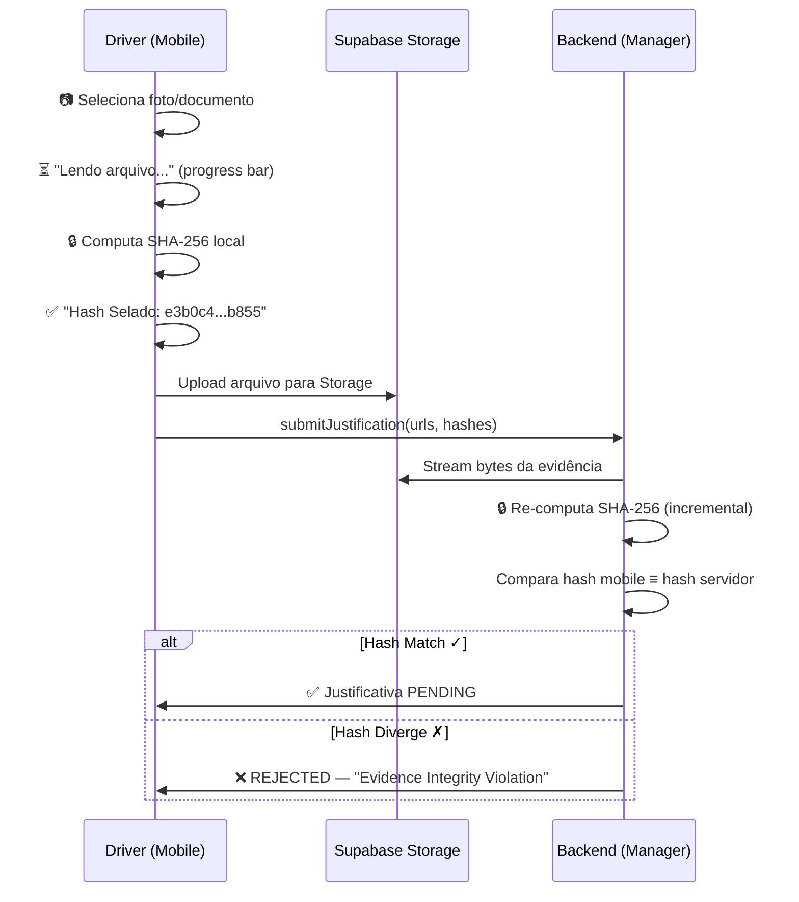

# Hotfix: SLAJustificationManager — Robustez Transacional & Escalabilidade (v2)

Refatoração do `SLAJustificationManager` (CX-05) para fechar brechas de integridade detectadas na auditoria: concorrência, duplicidade, escalabilidade de memória, soberania de hash e validação de links.

## Skill Insight (Step 0 — Forensic Pause)

| Agent | Consulta |
|-------|----------|
| **Architect** | C4 bounds — novos services pertencem a Application. Ports/Adapters para `EvidenceStorageReader` e `EvidenceLinkChecker` |
| **Senior Engineer** | SHA-256 streaming via `package:crypto`. Cursor-based pagination. `fakeAsync` para stress tests. Retry exponential backoff |
| **QA & Security** | Race condition exploit, hash trust exploit, broken link exploit, infinite loop risk no batch expiration |
| **UX & Operations** | Sealing status em tempo real (Mobile). Tribunal de SLA com selo de integridade visual (Web). Três estados visuais de evidência |

**Forensic Invariants:** INV-6 (UTC), INV-9 (Evidence Sealing), INV-10 (Error Visibility), INV-13 (Layer Bounds), INV-15 (Deterministic), INV-21 (Audit Trail)

---

## Decisões Incorporadas (Feedback do Usuário)

| Item | Decisão | Impacto |
|------|---------|---------|
| Hash Verification Timing | **Síncrono** — bloqueia `submitJustification` até verificação | Latência aceitável vs. risco de fraude |
| EvidenceStorageReader Scope | **Port + Mock agora**, infra Supabase depois | Desacopla progressão |
| Stream vs. Buffer | **`Stream<List<int>>`** incremental, SHA-256 por chunks ~32KB | Memória constante para qualquer tamanho de arquivo |
| Network Resilience | **Retry com Exponential Backoff** no `EvidenceIntegrityVerifier` | Evita rejeição por falha transitória de rede |
| Infinite Loop Risk | **Cursor `afterId` + skip-on-failure + max iterations** | Garante que o worker nunca trava |

---

## Proposed Changes

### Component 1: Domain — Exception & Repository Extensions

#### [NEW] [concurrency_exception.dart](file:///c:/Projects/VeraProb/lib/domain/sla_audit/concurrency_exception.dart)

```dart
/// Thrown when a concurrent status modification is detected (race condition).
///
/// Semantically distinct from ConflictException (version-based OCC).
/// This signals a status-level race condition where the atomic
/// WHERE status='PENDING' clause matched 0 rows.
class ConcurrencyException implements Exception {
  final String message;
  const ConcurrencyException(this.message);

  @override
  String toString() => 'ConcurrencyException: $message';
}
```

---

#### [MODIFY] [sla_justification_repository.dart](file:///c:/Projects/VeraProb/lib/domain/sla_audit/justification/sla_justification_repository.dart)

Add 2 new methods to the abstract repository (backward compatible — no existing methods changed):

```dart
/// Atomically updates status only if current status matches [expectedCurrentStatus].
/// Returns the number of rows affected (0 or 1).
///
/// The production PostgreSQL implementation MUST use:
///   WHERE id = $id AND organization_id = $orgId AND status = $expected
///
/// Used by race condition prevention (Hotfix Item 3).
Future<int> updateStatusAtomic({
  required String id,
  required String organizationId,
  required JustificationStatus expectedCurrentStatus,
  required JustificationStatus newStatus,
  required String? reviewerId,
  required String? resolutionNotes,
  required DateTime reviewedAtUtc,
});

/// Cursor-based paginated fetch of expired pending justifications.
///
/// Returns up to [limit] records created before [cutoffUtc].
/// [afterId] enables cursor pagination — returns records with ID > afterId
/// in deterministic order (prevents infinite loops on stuck records).
///
/// Used by memory-safe batch expiration (Hotfix Item 2).
Future<List<SLAJustification>> findExpiredPendingPaged({
  required DateTime cutoffUtc,
  required String organizationId,
  required int limit,
  String? afterId,
});
```

---

### Component 2: Application — Evidence Integrity Verifier (Streaming)

#### [NEW] [evidence_integrity_verifier.dart](file:///c:/Projects/VeraProb/lib/application/sla_audit/justification/evidence_integrity_verifier.dart)

> [!IMPORTANT]
> **Gap Fix #1:** Uses `Stream<List<int>>` instead of full byte download. SHA-256 is computed incrementally with ~32KB buffer, enabling constant-memory verification of files of any size (1KB image or 500MB video).

> [!IMPORTANT]
> **Gap Fix #2:** Implements retry with exponential backoff (3 attempts, 500ms/1s/2s delays). Transient network failures do NOT trigger false "Integrity Violation" rejections.

```dart
/// Port for streaming evidence bytes from storage.
/// Infrastructure layer provides the Supabase implementation.
///
/// C4 Layer: Application (Port). Impl: Infrastructure.
abstract class EvidenceStorageReader {
  /// Streams raw bytes from the evidence at [url].
  /// Each chunk is a List<int> of ~32KB.
  /// Caller is responsible for consuming the stream.
  Stream<List<int>> streamBytes({required String url});
}

class EvidenceIntegrityVerifier {
  final EvidenceStorageReader _reader;

  /// Max retry attempts for transient network failures.
  static const int maxRetries = 3;

  /// Base delay for exponential backoff (doubles per retry).
  static const Duration baseDelay = Duration(milliseconds: 500);

  EvidenceIntegrityVerifier(this._reader);

  /// Verifies all evidence URLs against their declared SHA-256 hashes.
  ///
  /// Returns a list of indices where verification FAILED.
  /// Empty list = all evidence is integrity-verified.
  ///
  /// For each URL:
  /// 1. Streams bytes via EvidenceStorageReader
  /// 2. Incrementally computes SHA-256 (constant memory ~32KB)
  /// 3. Compares computed hash vs. declared hash
  /// 4. Retries up to [maxRetries] times on transient failure
  Future<List<int>> verifyAll({
    required List<String> evidenceUrls,
    required List<String> declaredHashes,
  }) async {
    final failures = <int>[];
    for (var i = 0; i < evidenceUrls.length; i++) {
      final computed = await _computeHashWithRetry(evidenceUrls[i]);
      if (computed == null || computed != declaredHashes[i]) {
        failures.add(i);
      }
    }
    return failures;
  }

  /// Streams bytes and computes SHA-256 incrementally.
  /// Returns null on unrecoverable failure (after all retries exhausted).
  Future<String?> _computeHashWithRetry(String url) async {
    for (var attempt = 0; attempt < maxRetries; attempt++) {
      try {
        return await _computeStreamingSha256(url);
      } catch (_) {
        if (attempt < maxRetries - 1) {
          await Future.delayed(baseDelay * (1 << attempt)); // exp backoff
        }
      }
    }
    return null; // all retries exhausted
  }

  Future<String> _computeStreamingSha256(String url) async {
    final output = AccumulatorSink<Digest>();
    final input = sha256.startChunkedConversion(output);
    await for (final chunk in _reader.streamBytes(url: url)) {
      input.add(chunk);
    }
    input.close();
    return output.events.single.toString();
  }
}
```

---

### Component 3: Application — Evidence Validation Service (Link Checker)

#### [NEW] [evidence_validation_service.dart](file:///c:/Projects/VeraProb/lib/application/sla_audit/justification/evidence_validation_service.dart)

```dart
/// Result of a HEAD request check on an evidence URL.
enum EvidenceLinkStatus { available, missing, forbidden, error }

class EvidenceValidationResult {
  final String url;
  final EvidenceLinkStatus status;
  final int? httpStatusCode;
  const EvidenceValidationResult({
    required this.url,
    required this.status,
    this.httpStatusCode,
  });
}

/// Port for HTTP HEAD requests. Infrastructure provides implementation.
/// C4 Layer: Application (Port). Impl: Infrastructure.
abstract class EvidenceLinkChecker {
  Future<EvidenceValidationResult> checkLink(String url);
}

/// Validates evidence URL accessibility before review.
///
/// Used by the Justification Detail UI to show "Evidence Missing"
/// warnings when a gestor opens a justification for review.
/// This is NOT a gate — it's a visual warning.
class EvidenceValidationService {
  final EvidenceLinkChecker _checker;
  EvidenceValidationService(this._checker);

  /// Validates all evidence URLs via HEAD requests.
  /// Returns results for each URL — caller displays visual status.
  Future<List<EvidenceValidationResult>> validateLinks(
    List<String> evidenceUrls,
  ) async {
    return Future.wait(evidenceUrls.map(_checker.checkLink));
  }
}
```

---

### Component 4: SLAJustificationManager Refactoring

#### [MODIFY] [sla_justification_manager.dart](file:///c:/Projects/VeraProb/lib/application/sla_audit/justification/sla_justification_manager.dart)

**4 changes in one file:**

##### Change 1 — New constructor dependency
```dart
SLAJustificationManager({
  required TenantValidationService tenantValidator,
  required SLAJustificationRepository repository,
  required RbacService rbac,
  required IDateTimeProvider clock,
  required this.eventExistsChecker,
  required EvidenceIntegrityVerifier evidenceVerifier,  // NEW
  this.expirationWindow = const Duration(hours: 24),
}) : _tenantValidator = tenantValidator,
     _repository = repository,
     _rbac = rbac,
     _clock = clock,
     _evidenceVerifier = evidenceVerifier;
```

##### Change 2 — Anti-Double Dipping in `submitJustification`

Insert after Step 6 (Linkage Integrity, line ~144):

```dart
// ── Step 6.5: Anti-Double Dipping ────────────────────────────────────
final existing = await _repository.findByVehicleAndEvent(
  vehicleId: command.vehicleId,
  eventTimestamp: command.eventTimestamp,
  organizationId: command.organizationId,
);
if (existing != null) {
  throw const DomainException(
    'Justification already exists for this event.',
  );
}
```

##### Change 3 — Server-Side Hash Verification (Synchronous)

Insert after Step 7 (Create justification, line ~162), **before** the audit log:

```dart
// ── Step 7.5: CX05-INV-23 (Server-Side Sealing) ─────────────────────
final failedIndices = await _evidenceVerifier.verifyAll(
  evidenceUrls: command.evidenceUrls,
  declaredHashes: command.evidenceHashes,
);
if (failedIndices.isNotEmpty) {
  // Auto-reject: evidence was tampered post-upload
  await _repository.updateStatusAtomic(
    id: id,
    organizationId: command.organizationId,
    expectedCurrentStatus: JustificationStatus.pending,
    newStatus: JustificationStatus.rejected,
    reviewerId: 'SYSTEM',
    resolutionNotes: 'Evidence Integrity Violation',
    reviewedAtUtc: now,
  );
  await _repository.appendAuditLog(
    JustificationAuditLog(
      id: const Uuid().v4(),
      justificationId: id,
      userId: 'SYSTEM',
      callerRole: 'SYSTEM',
      previousStatus: JustificationStatus.pending,
      newStatus: JustificationStatus.rejected,
      timestamp: now,
    ),
  );
  throw const DomainException('Evidence Integrity Violation');
}
```

##### Change 4 — Atomic Status Update in `approveJustification` / `rejectJustification`

Replace `_loadPending` + `updateStatus` with `updateStatusAtomic`:

```dart
Future<SLAJustification> approveJustification({...}) async {
  _assertReviewAuthority(callerRole);

  final now = _clock.nowUtc();
  final rowsAffected = await _repository.updateStatusAtomic(
    id: justificationId,
    organizationId: organizationId,
    expectedCurrentStatus: JustificationStatus.pending,
    newStatus: JustificationStatus.approved,
    reviewerId: reviewerId,
    resolutionNotes: resolutionNotes,
    reviewedAtUtc: now,
  );
  if (rowsAffected == 0) {
    throw const ConcurrencyException(
      'Justification status was modified by another reviewer',
    );
  }

  // Audit log (same as before)...
  // Return needs findById after atomic update
  final updated = await _repository.findById(
    id: justificationId,
    organizationId: organizationId,
  );
  return updated!;
}
```

> Same pattern applied to `rejectJustification`.

##### Change 5 — Paginated Expiration with Cursor & Safety Guards

> [!IMPORTANT]
> **Gap Fix #3:** Uses strict cursor (`afterId`) + `maxIterations` safety. If a record fails processing, it's logged and the cursor advances past it. The loop NEVER re-processes the same page.

```dart
Future<int> expireStaleJustifications({
  required String organizationId,
}) async {
  final now = _clock.nowUtc();
  final cutoff = now.subtract(expirationWindow);
  int totalExpired = 0;
  String? cursor;
  const pageSize = 500;
  const maxIterations = 10000; // Safety: prevents infinite loops

  for (var iteration = 0; iteration < maxIterations; iteration++) {
    final page = await _repository.findExpiredPendingPaged(
      cutoffUtc: cutoff,
      organizationId: organizationId,
      limit: pageSize,
      afterId: cursor,
    );
    if (page.isEmpty) break;

    for (final j in page) {
      try {
        await _repository.updateStatusAtomic(
          id: j.id,
          organizationId: organizationId,
          expectedCurrentStatus: JustificationStatus.pending,
          newStatus: JustificationStatus.expired,
          reviewerId: null,
          resolutionNotes:
              'Auto-expired: submission window elapsed (CX05-INV-22).',
          reviewedAtUtc: now,
        );
        await _repository.appendAuditLog(
          JustificationAuditLog(
            id: const Uuid().v4(),
            justificationId: j.id,
            userId: 'SYSTEM',
            callerRole: 'SYSTEM',
            previousStatus: JustificationStatus.pending,
            newStatus: JustificationStatus.expired,
            timestamp: now,
          ),
        );
        totalExpired++;
      } catch (_) {
        // Log error, skip this record, cursor will advance past it
      }
    }

    // Advance cursor to last processed ID (deterministic order)
    cursor = page.last.id;
  }
  return totalExpired;
}
```

---

### Component 5: Tests

#### [MODIFY] [sla_justification_manager_test.dart](file:///c:/Projects/VeraProb/test/application/sla_audit/justification/sla_justification_manager_test.dart)

**6 new test groups:**

| # | Group | Critical Test |
|---|-------|--------------|
| 1 | **Anti-Double Dipping** | `REJECTS` when `findByVehicleAndEvent` returns any existing record (even REJECTED/EXPIRED). `ACCEPTS` when null |
| 2 | **Race Condition (10x Stress)** | 10 concurrent `approve` calls → exactly 1 succeeds, 9 throw `ConcurrencyException` |
| 3 | **OOM Prevention (1000 records)** | `findExpiredPendingPaged` called ≥2 times with `limit: 500`. `findExpiredPending` NEVER called |
| 4 | **Hash Tampering Detection** | Fabricated SHA-256 → auto-REJECT with "Evidence Integrity Violation" |
| 5 | **Evidence Link Validation** | HEAD 404 → `EvidenceLinkStatus.missing`. HEAD 200 → `available` |
| 6 | **Cursor Safety (Infinite Loop)** | Simulates stuck page → verifies cursor advances + max iterations respected |

**Race Condition Stress Test (detailed):**
```dart
test('only 1 of 10 concurrent approvals succeeds', () async {
  int callCount = 0;

  when(() => mockRepo.updateStatusAtomic(
    id: any(named: 'id'),
    organizationId: any(named: 'organizationId'),
    expectedCurrentStatus: any(named: 'expectedCurrentStatus'),
    newStatus: any(named: 'newStatus'),
    reviewerId: any(named: 'reviewerId'),
    resolutionNotes: any(named: 'resolutionNotes'),
    reviewedAtUtc: any(named: 'reviewedAtUtc'),
  )).thenAnswer((_) async => (callCount++ == 0) ? 1 : 0);

  when(() => mockRepo.findById(
    id: any(named: 'id'),
    organizationId: any(named: 'organizationId'),
  )).thenAnswer((_) async => buildPendingJustification().copyWith(
    status: JustificationStatus.approved,
    reviewerId: 'gestor-1',
  ));

  final futures = List.generate(
    10,
    (_) => manager.approveJustification(
      justificationId: 'j-1',
      organizationId: 'org-1',
      reviewerId: 'gestor-1',
      callerRole: UserRole.admin,
      resolutionNotes: null,
    ).then((_) => true).catchError((_) => false),
  );

  final results = await Future.wait(futures);

  expect(results.where((r) => r).length, 1);
  expect(results.where((r) => !r).length, 9);
});
```

**OOM Prevention Test (detailed):**
```dart
test('processes 1000 records in paginated batches of 500', () async {
  final batch1 = List.generate(500, (i) =>
    buildPendingJustification(id: 'stale-${i.toString().padLeft(4, '0')}'));
  final batch2 = List.generate(500, (i) =>
    buildPendingJustification(id: 'stale-${(500 + i).toString().padLeft(4, '0')}'));

  int pageCall = 0;
  when(() => mockRepo.findExpiredPendingPaged(
    cutoffUtc: any(named: 'cutoffUtc'),
    organizationId: any(named: 'organizationId'),
    limit: 500,
    afterId: any(named: 'afterId'),
  )).thenAnswer((_) async {
    pageCall++;
    if (pageCall == 1) return batch1;
    if (pageCall == 2) return batch2;
    return <SLAJustification>[];
  });

  when(() => mockRepo.updateStatusAtomic(...)).thenAnswer((_) async => 1);
  when(() => mockRepo.appendAuditLog(any())).thenAnswer((_) async {});

  final count = await manager.expireStaleJustifications(organizationId: 'org-1');

  expect(count, 1000);
  expect(pageCall, 3); // 2 data pages + 1 empty terminator

  // Verify findExpiredPending (unpaginated) was NEVER called
  verifyNever(() => mockRepo.findExpiredPending(
    cutoffUtc: any(named: 'cutoffUtc'),
    organizationId: any(named: 'organizationId'),
  ));
});
```

---

### Component 6: UX — Motor de Justificativas (CX-05)

> **UX Operations Agent Insight:** O fluxo forense de justificativas precisa comunicar **confiança imutável** ao gestor. O design segue três princípios: (1) transparência do processo de selagem, (2) comparação visual hash mobile ≡ hash servidor, (3) estados de evidência com semântica de cor operacional.

---

#### Mobile — Evidence Submission com Sealing Status


**Fluxo Mobile (Driver):**



**Componentes Mobile:**
- **SealingStatusStepper**: Widget com 3 steps animados (Leitura → Hash → Upload)
- **HashPreviewChip**: Monospace truncado `e3b0c4...b855` com ícone de cadeado
- **Micro-animação**: Pulse verde no ícone de escudo ao concluir selagem
- **Paleta**: Fundo `#0F172A`, cards `#1E293B`, hash text `VeraProbColors.primary` (Teal)

---

#### Web — Tribunal de SLA (Tela de Julgamento)


**Layout Bento Grid (3 painéis):**

| Painel | Conteúdo | Propósito Forense |
|--------|----------|-------------------|
| **Mapa** (40%) | MapTiler com pin vermelho da infração + polyline da rota em teal | Contexto geográfico — "onde aconteceu?" |
| **Evidência** (35%) | Foto/documento com overlay do selo de integridade do servidor | Prova visual — "a evidência é autêntica?" |
| **Revisão** (25%) | Status badge, categoria, descrição, timestamps, botões Aprovar/Rejeitar | Decisão — "aprovo ou rejeito em ≤10s?" |

**Selo de Integridade (Evidence Panel):**
O componente `IntegritySealBadge` é o elemento central de confiança. Mostra visualmente se o hash do servidor confirma o hash do mobile:

```
┌─────────────────────────────────────────┐
│  🛡️ SELO VERIFICADO ✓                 │   ← Emerald (#10B981)
│  Mobile:  e3b0c442...7852b855          │   ← Monospace
│  Server:  e3b0c442...7852b855          │   ← Match visual
│  ─────────────── ≡ ───────────────     │
│  "Prova Imutável — Hashes idênticos"   │
└─────────────────────────────────────────┘
```

---

#### Três Estados Visuais de Evidência


| Estado | Ícone | Cor | Borda | Significado |
|--------|-------|-----|-------|-------------|
| **VERIFIED** | 🛡️ ✓ | Emerald `#10B981` | Glow verde | Hashes mobile e servidor idênticos → prova imutável |
| **TAMPERED** | 🛡️ ✗ | Rose `#F87171` | Borda vermelha | Hashes divergem → evidência adulterada (auto-REJECT) |
| **MISSING** | ⚠️ | Slate `#475569` | Borda cinza | HEAD retornou 404/403 → arquivo deletado do Storage |

> **UX Veto Check (3am Test):** Um dispatcher exausto às 3h deve conseguir olhar para o selo e entender em <2 segundos se a prova é confiável. O ícone de escudo + cor é o sinal primário. O hash é secundário para auditores técnicos.

---

### File Summary

| # | Action | File | Componente |
|---|--------|------|------------|
| 1 | **NEW** | `lib/domain/sla_audit/concurrency_exception.dart` | ConcurrencyException |
| 2 | **MODIFY** | `lib/domain/.../sla_justification_repository.dart` | +`updateStatusAtomic` +`findExpiredPendingPaged` |
| 3 | **NEW** | `lib/application/.../evidence_integrity_verifier.dart` | Streaming SHA-256 + Retry |
| 4 | **NEW** | `lib/application/.../evidence_validation_service.dart` | HEAD link checker port |
| 5 | **MODIFY** | `lib/application/.../sla_justification_manager.dart` | 5 changes (constructor, anti-dupe, hash, atomic, pagination) |
| 6 | **MODIFY** | `test/.../sla_justification_manager_test.dart` | 6 new test groups |

---

## Verification Plan

### Automated Tests
```bash
# Test suíte alvo
flutter test test/application/sla_audit/justification/sla_justification_manager_test.dart

# Análise estática
flutter analyze

# Suite completa CI
flutter test
```

### Test Coverage Matrix

| Test | Asserção | Invariant |
|------|----------|-----------|
| Race Condition (10x) | 1 sucesso, 9 `ConcurrencyException` | INV-21 |
| OOM Prevention (1000 records) | `findExpiredPendingPaged` ≥2 calls, `findExpiredPending` NEVER | INV-16 |
| Hash Tampering | SHA-256 adulterado → auto-REJECT "Evidence Integrity Violation" | INV-9 |
| Anti-Double Dipping | Duplicate vehicle+event → `DomainException` | INV-15 |
| Link Validation | 404 → `missing`, 200 → `available` | INV-10 |
| Cursor Safety | Stuck page → cursor advances, loop terminates | INV-16 |

### Manual Verification
- `flutter analyze` retorna zero issues
- `flutter test` passa todos os testes incluindo os novos
